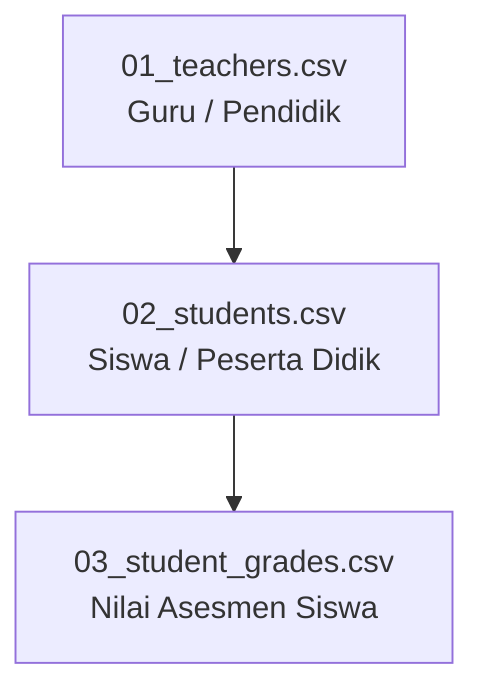

# StudentCenter — Panduan Import Data CSV (Production Ready)

Dokumen ini menjelaskan tata cara, urutan dependensi, spesifikasi endpoint API, serta format validasi untuk melakukan import data CSV ke dalam sistem **StudentCenter**.

---

## 1. Urutan Import CSV Resmi (Dependency Order)

Sistem **StudentCenter** memiliki 3 endpoint import resmi berbasis file CSV. Proses import HARUS dilakukan secara berurutan sesuai alur dependensi berikut:



1. **`01_teachers.csv`** (Import Akun Guru via `POST /api/users/import-teachers`)
2. **`02_students.csv`** (Import Akun Siswa via `POST /api/users/import-students`)  
   *Catatan: Nama Kelas dan Kode/Nama Jurusan harus sudah ada di master data sebelum melakukan import siswa.*
3. **`03_student_grades.csv`** (Import Nilai Ujian/Asesmen Siswa via `POST /api/student-grades/import-csv?assessmentId={id}`)  
   *Catatan: NIS Siswa dan ID Asesmen Penilaian harus sudah terdaftar di sistem.*

---

## 2. Spesifikasi Template CSV & Endpoint API

### 📋 1. `01_teachers.csv` — Import Data Guru
- **Endpoint**: `POST /api/users/import-teachers`
- **Method**: `POST` (Multipart Form-Data / Raw CSV String)
- **Header Kolom**:
  `Nama,NIP,Email,HP,Alamat,Gender,Tanggal Lahir,Position,Password`
- **Rincian Kolom**:
  - `Nama` *(Wajib)*: Nama lengkap guru beserta gelar.
  - `NIP` *(Opsional/Unik)*: Nomor Induk Pegawai.
  - `Email` *(Opsional)*: Alamat email aktif (apabila kosong, sistem membuat otomatis berbasis NIP).
  - `HP` *(Opsional)*: Nomor HP/WhatsApp (Contoh: `081298765432`).
  - `Alamat` *(Opsional)*: Alamat tempat tinggal.
  - `Gender` *(Opsional)*: `Male` / `Female`.
  - `Tanggal Lahir` *(Opsional)*: Format `YYYY-MM-DD` (Contoh: `1989-07-10`).
  - `Position` *(Opsional)*: Jabatan/posisi (Default: `Guru`).
  - `Password` *(Opsional)*: Password akun (Default: `Guru123!`).

---

### 🎓 2. `02_students.csv` — Import Data Siswa
- **Endpoint**: `POST /api/users/import-students`
- **Method**: `POST` (Multipart Form-Data / Raw CSV String)
- **Header Kolom**:
  `Nama,NIS,NISN,Jurusan,Kelas,Email,HP,Gender,Tanggal Lahir,Alamat,Nomor Absen,Password`
- **Rincian Kolom**:
  - `Nama` *(Wajib)*: Nama lengkap siswa.
  - `NIS` *(Opsional/Unik)*: Nomor Induk Siswa.
  - `NISN` *(Opsional/Unik)*: Nomor Induk Siswa Nasional.
  - `Jurusan` *(Wajib)*: Kode/Nama Jurusan yang terdaftar di sistem (Contoh: `RPL`).
  - `Kelas` *(Wajib)*: Nama Kelas yang terdaftar di sistem (Contoh: `X RPL 1`).
  - `Email` *(Opsional)*: Alamat email aktif siswa.
  - `HP` *(Opsional)*: Nomor telepon/HP siswa.
  - `Gender` *(Opsional)*: `Male` / `Female`.
  - `Tanggal Lahir` *(Opsional)*: Format `YYYY-MM-DD` (Contoh: `2008-05-14`).
  - `Alamat` *(Opsional)*: Alamat rumah siswa.
  - `Nomor Absen` *(Opsional)*: Angka nomor urut presensi kelas.
  - `Password` *(Opsional)*: Password akun (Default: `Siswa123!`).

---

## 📝 3. `03_student_grades.csv` — Import Nilai Asesmen
- **Endpoint**: `POST /api/student-grades/import-csv?assessmentId={assessmentId}`
- **Method**: `POST` (Multipart Form-Data)
- **Query Parameter**: `assessmentId` (GUID Asesmen Penilaian)
- **Header Kolom**:
  `NIS,Nama,RawScore,MaxScore,LetterGrade,Predicate,Remarks`
- **Rincian Kolom**:
  - `NIS` *(Wajib)*: Nomor Induk Siswa yang terdaftar di sistem.
  - `Nama` *(Informasi)*: Nama siswa (digunakan untuk verifikasi visual visualizer).
  - `RawScore` *(Wajib)*: Nilai mentah siswa (Contoh: `88.5`, `92.0`).
  - `MaxScore` *(Informasi)*: Nilai maksimal asesmen.
  - `LetterGrade` *(Opsional)*: Huruf mutu nilai (Contoh: `A`, `B`).
  - `Predicate` *(Opsional)*: Predikat kelulusan (Contoh: `Sangat Baik`, `Baik`).
  - `Remarks` *(Opsional)*: Catatan penilaian/umpan balik dari guru.

---

## 💻 4. Contoh Request Import API (cURL)

### Import Guru:
```bash
curl -X POST "http://localhost:5051/api/users/import-teachers" \
  -H "Authorization: Bearer <TOKEN_ADMIN>" \
  -F "file=@01_teachers.csv"
```

### Import Siswa:
```bash
curl -X POST "http://localhost:5051/api/users/import-students" \
  -H "Authorization: Bearer <TOKEN_ADMIN>" \
  -F "file=@02_students.csv"
```

### Import Nilai Asesmen:
```bash
curl -X POST "http://localhost:5051/api/student-grades/import-csv?assessmentId=c2f9e636-46e4-41ee-be4d-b7c379d10b73" \
  -H "Authorization: Bearer <TOKEN_GURU>" \
  -F "file=@03_student_grades.csv"
```

---

## ℹ️ 5. Catatan Manajemen Master Data Lainnya

Entitas lain seperti **Kelas** (`/api/classes`), **Mata Pelajaran** (`/api/subjects`), **Fasilitas** (`/api/facilities`), **Ekstrakurikuler** (`/api/extracurriculars`), **Pengumuman** (`/api/announcements`), **Kalender** (`/api/calendar`), **Pemilu OSIS** (`/api/elections`), dan **Proposal** (`/api/proposals`) dikelola secara langsung melalui REST API JSON (`POST / PUT / DELETE`) dan tidak menggunakan file import CSV.
