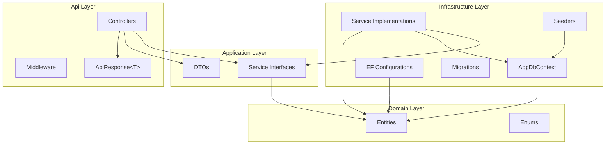
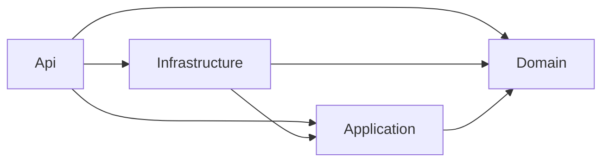

---
tags:
  - architecture
  - backend
aliases:
  - Architecture
---

# Architecture

StudentCenter follows [[Clean Architecture]] principles, separating concerns into four distinct layers.

## Solution Structure

```
backend/
├── StudentCenter.Api/            # Presentation Layer
├── StudentCenter.Application/    # Application Layer
├── StudentCenter.Domain/         # Domain Layer
├── StudentCenter.Infrastructure/ # Infrastructure Layer
└── StudentCenter.slnx
```

## Layer Diagram



## Dependency Flow



- **Domain** has zero dependencies (innermost layer)
- **Application** depends only on Domain
- **Infrastructure** implements Application interfaces using Domain entities
- **Api** wires everything together via DI

## Key Patterns

| Pattern | Implementation |
|---------|---------------|
| Dependency Injection | `Program.cs` registers all services |
| Service Layer | `IUserService`, `IAnnouncementService` in Application, implemented in Infrastructure |
| DTOs | Request/Response objects in `Application/DTOs/` |
| Entity Configuration | Fluent API via `IEntityTypeConfiguration<T>` |
| Seeding | `SeedAdminData` runs on startup |

See [[Dependency Rules]] for the strict dependency constraints between layers.

## Related

- [[Clean Architecture]]
- [[Dependency Rules]]
- [[Backend Overview]]
- [[Request Pipeline]]
- [[Tech Stack]]
- [[MOC - Architecture]]
