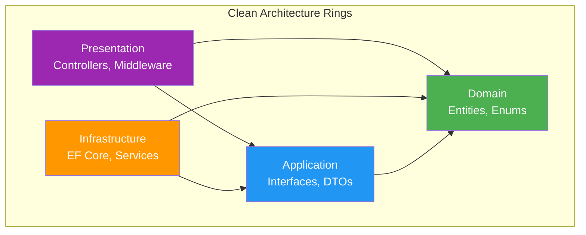

---
tags:
  - architecture
  - backend
  - decision
aliases:
  - Clean Architecture
---

# Clean Architecture

StudentCenter backend implements Clean Architecture (Robert C. Martin) adapted for ASP.NET Core.

## Layers

### Domain Layer (`StudentCenter.Domain`)

The innermost layer containing business entities and enums. Has **zero** external dependencies.

- [[Entity - User]]
- [[Entity - Announcement]]
- `UserRole` enum

### Application Layer (`StudentCenter.Application`)

Contains service interfaces and DTOs. Depends only on Domain.

- `IUserService`, `IJwtService`, `ICurrentUserService`, `IAnnouncementService`
- Request/Response DTOs (`LoginRequest`, `AnnouncementResponse`, etc.)
- [[API Contract]] data shapes

### Infrastructure Layer (`StudentCenter.Infrastructure`)

Implements Application interfaces. Contains database access, external service integrations.

- `AppDbContext` (EF Core)
- Entity configurations (Fluent API)
- Service implementations (`UserService`, `JwtService`, `AnnouncementService`, `CurrentUserService`)
- [[Migrations]]
- [[Database Schema]] seeders

### Presentation Layer (`StudentCenter.Api`)

ASP.NET Core Web API. Controllers, middleware, response models.

- `AuthController`, `AnnouncementController`, `HomeController`
- `ApiResponse<T>` wrapper
- JWT authentication configuration
- DI registration in `Program.cs`

## Diagram

## Related

- [[Architecture]]
- [[Dependency Rules]]
- [[Backend Overview]]
- [[MOC - Backend]]
