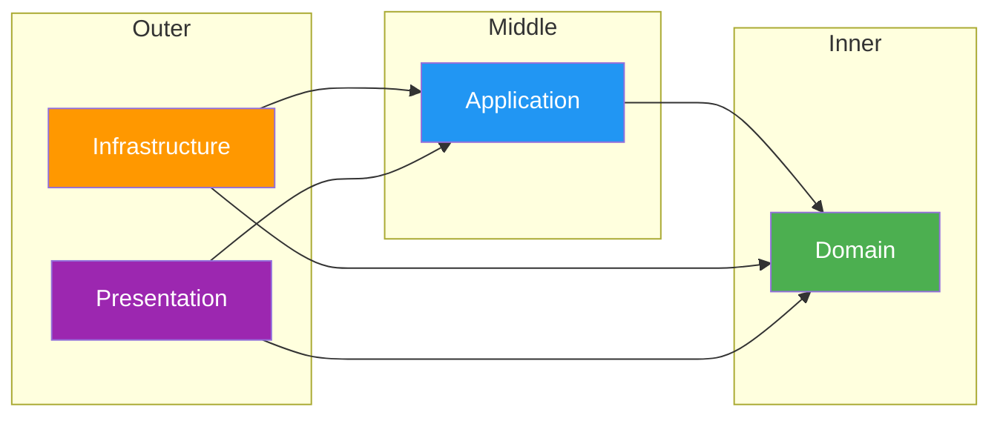

---
tags:
  - architecture
  - backend
aliases:
  - Dependency Rules
---

# Dependency Rules

The [[Clean Architecture]] enforces strict dependency rules between layers. Dependencies always point **inward** — outer layers depend on inner layers, never the reverse.

## The Rule



## Allowed Dependencies

| Layer | Can Depend On | Cannot Depend On |
|-------|--------------|------------------|
| **Domain** | Nothing | Application, Infrastructure, Api |
| **Application** | Domain | Infrastructure, Api |
| **Infrastructure** | Application, Domain | Api |
| **Api (Presentation)** | Application, Domain, Infrastructure | — |

## How It Works in StudentCenter

### Domain knows nothing

`StudentCenter.Domain` has **zero** NuGet packages and **zero** project references. It contains only:
- [[Entity - User]]
- [[Entity - Announcement]]
- `UserRole` enum

### Application defines contracts

`StudentCenter.Application` references only Domain. It defines:
- Service **interfaces** (`IUserService`, `IJwtService`, `IAnnouncementService`, `ICurrentUserService`)
- **DTOs** that shape data crossing layer boundaries

### Infrastructure implements contracts

`StudentCenter.Infrastructure` references Application and Domain. It provides:
- Concrete service implementations
- `AppDbContext` (EF Core)
- Entity configurations
- [[Migrations]]

### Api wires everything

`StudentCenter.Api` references all three projects and registers implementations via Dependency Injection in `Program.cs`.

## Dependency Inversion Principle

The Application layer defines interfaces; Infrastructure implements them. This means:
- Business logic never depends on database details
- Swapping PostgreSQL for another database only requires changes in Infrastructure
- Services are testable in isolation via mock implementations

## .csproj References

```xml
<!-- Domain: no references -->

<!-- Application -->
<ProjectReference Include="..\StudentCenter.Domain\StudentCenter.Domain.csproj" />

<!-- Infrastructure -->
<ProjectReference Include="..\StudentCenter.Application\StudentCenter.Application.csproj" />
<ProjectReference Include="..\StudentCenter.Domain\StudentCenter.Domain.csproj" />

<!-- Api -->
<ProjectReference Include="..\StudentCenter.Application\StudentCenter.Application.csproj" />
<ProjectReference Include="..\StudentCenter.Domain\StudentCenter.Domain.csproj" />
<ProjectReference Include="..\StudentCenter.Infrastructure\StudentCenter.Infrastructure.csproj" />
```

## Related

- [[Clean Architecture]]
- [[Architecture]]
- [[MOC - Architecture]]
