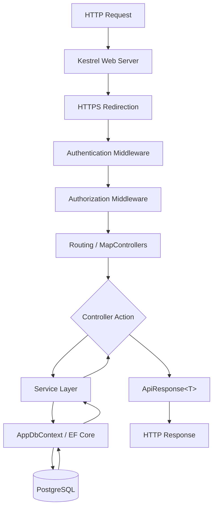

---
tags:
  - backend
  - architecture
aliases:
  - Request Pipeline
---

# Request Pipeline

The ASP.NET Core request pipeline for StudentCenter API.

## Pipeline Diagram



## Middleware Order (Program.cs)

1. `UseHttpsRedirection()`
2. `UseAuthentication()`
3. `UseAuthorization()`
4. `MapControllers()`

## Startup Sequence

1. Configure `AppDbContext` with Npgsql
2. Register services via DI (`IUserService`, `IJwtService`, etc.)
3. Configure JWT Bearer authentication
4. Run `SeedAdminData.SeedAsync()` before handling requests
5. Start listening on configured URLs

## DI Registrations

| Interface | Implementation | Lifetime |
|-----------|---------------|----------|
| `ICurrentUserService` | `CurrentUserService` | Scoped |
| `IJwtService` | `JwtService` | Scoped |
| `IUserService` | `UserService` | Scoped |
| `IAnnouncementService` | `AnnouncementService` | Scoped |

## API Response Wrapper

All responses use `ApiResponse<T>`:

```csharp
public class ApiResponse<T>
{
    public bool Success { get; set; }
    public string Message { get; set; }
    public T? Data { get; set; }
}
```

## Related

- [[Architecture]]
- [[Authentication]]
- [[Clean Architecture]]
- [[MOC - Backend]]
