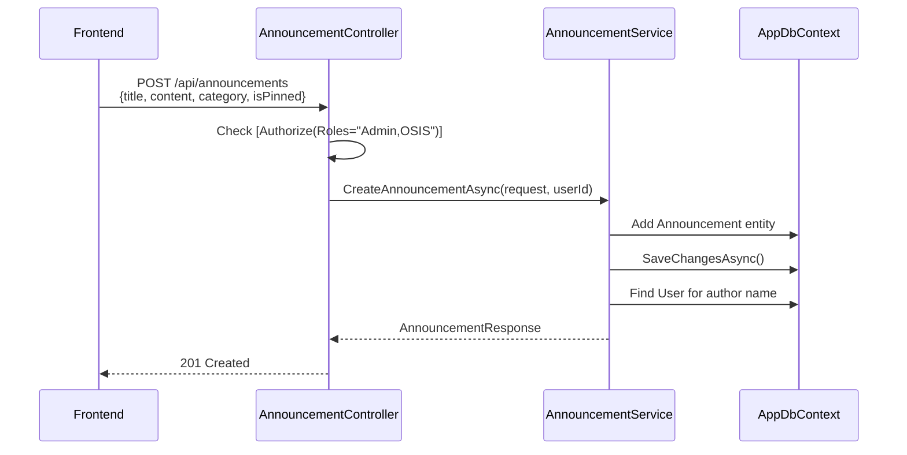

---
tags:
  - announcement
  - feature
  - backend
  - api
aliases:
  - Announcements
  - Feature - Announcements
---

# Feature - Announcements

The Announcements module is the first fully implemented feature in StudentCenter. It provides a digital bulletin board for school-wide communication.

## Status

**Implemented** (Backend CRUD complete)

## Capabilities

| Operation | Endpoint | Auth | Roles |
|-----------|----------|------|-------|
| List (paginated) | `GET /api/announcements` | Required | All |
| Get by ID | `GET /api/announcements/{id}` | Required | All |
| Create | `POST /api/announcements` | Required | Admin, OSIS |
| Update | `PUT /api/announcements/{id}` | Required | Admin, OSIS |
| Delete | `DELETE /api/announcements/{id}` | Required | Admin, OSIS |

## CRUD Flow

## Data Model

See [[Entity - Announcement]] for the full entity definition and [[Database Schema]] for column details.

## Query Features

- **Pagination**: `page` and `pageSize` query parameters
- **Category filter**: `category` query parameter
- **Sorting**: Pinned announcements first, then by `CreatedAt` descending

## Planned Features (per [[Frontend Project Context]])

- Announcement list with search
- Announcement detail view
- Attachments (PDF, DOC, DOCX)
- Category filtering
- Cover images

## Related

- [[Entity - Announcement]]
- [[API Contract]]
- [[Database Schema]]
- [[User Roles]]
- [[MOC - Features]]
