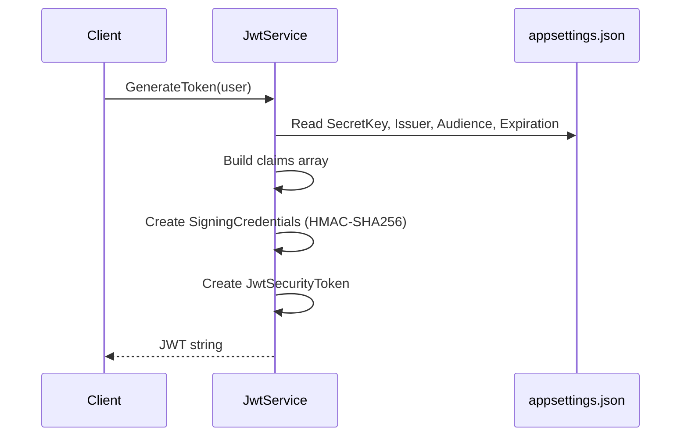

---
tags:
  - backend
  - authentication
aliases:
  - JWT
  - JWT Service
  - JwtService
---

# JWT

StudentCenter uses JSON Web Tokens for stateless [[Authentication]].

## Token Generation

`JwtService` (in Infrastructure) generates tokens with claims from the [[Entity - User]].

## Claims

| Claim | Type | Source |
|-------|------|--------|
| `sub` | Registered | `User.Id` |
| `nameid` | Registered | `User.Id` |
| `email` | Registered | `User.Email` |
| `jti` | Registered | Random GUID (token ID) |
| `ClaimTypes.NameIdentifier` | .NET | `User.Id` |
| `ClaimTypes.Email` | .NET | `User.Email` |
| `ClaimTypes.GivenName` | .NET | `User.FullName` |
| `ClaimTypes.Role` | .NET | `User.Role` (enum string) |
| `given_name` | Custom | `User.FullName` |
| `role` | Custom | `User.Role` (enum string) |

## Configuration

From `appsettings.json`:

| Setting | Value |
|---------|-------|
| Issuer | `StudentCenter` |
| Audience | `StudentCenterApp` |
| Expiration | 60 minutes |
| Algorithm | HMAC-SHA256 |
| Key Length | 256-bit symmetric key |

## Token Validation

Configured in `Program.cs` via `AddJwtBearer()`:

- Validates issuer, audience, lifetime, and signing key
- Uses `SymmetricSecurityKey` with the secret from config

## Token Flow



## Consuming the Token

`CurrentUserService` extracts claims from the HTTP context:

| Property | Reads From |
|----------|-----------|
| `UserId` | `ClaimTypes.NameIdentifier` or `nameid` |
| `Email` | `ClaimTypes.Email` or `email` |
| `FullName` | `ClaimTypes.GivenName` or `given_name` |
| `Role` | `ClaimTypes.Role` or `role` |
| `IsAuthenticated` | `Identity.IsAuthenticated` |

## Service Interface

```csharp
public interface IJwtService
{
    string GenerateToken(User user);
}
```

## Related

- [[Authentication]]
- [[Entity - User]]
- [[User Roles]]
- [[Request Pipeline]]
- [[Backend Overview]]
- [[MOC - Backend]]
