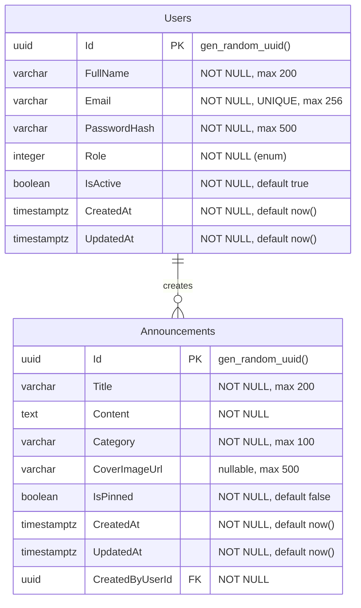

---
tags:
  - database
  - backend
aliases:
  - Database ERD
  - ERD
---

# Database ERD

Entity Relationship Diagram for the StudentCenter database.

## Current Tables

| Table | Entity | Status |
|-------|--------|--------|
| Users | [[Entity - User]] | Implemented |
| Announcements | [[Entity - Announcement]] | Implemented |

## Planned Tables (based on [[API Contract]])

| Table | Feature | Status |
|-------|---------|--------|
| Events | [[Feature - School Calendar]] | Planned |
| Clubs | [[Feature - Extracurricular]] | Planned |
| ClubMembers | [[Feature - Extracurricular]] | Planned |
| Facilities | [[Feature - Facility Booking]] | Planned |
| Bookings | [[Feature - Facility Booking]] | Planned |
| Proposals | [[Feature - Proposals]] | Planned |
| Elections | Future | Planned |

## Related

- [[Database Schema]]
- [[Migrations]]
- [[MOC - Database]]
