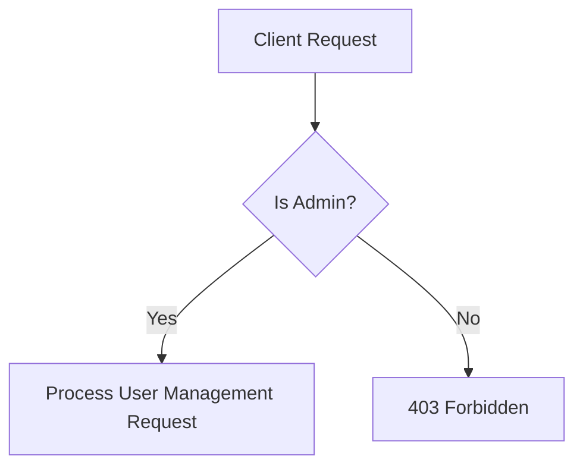

---
tags:
  - feature
  - user
  - admin
aliases:
  - Feature - User Management
  - User Management
---

# Feature - User Management

The User Management module provides administrative capabilities to search, filter, paginate, update, and manage all users on the platform.

## Status

**Implemented** (Backend CRUD complete)

## Access Policy

Access is strictly restricted to **Admin** users only.

## Endpoints

| Method | Endpoint | Authorization | Description |
|--------|----------|---------------|-------------|
| GET | `/api/users` | Admin | List users (paginated, searchable, filterable) |
| GET | `/api/users/{id}` | Admin | Get user details by ID |
| POST | `/api/users` | Admin | Create a new user (with password hashing) |
| PUT | `/api/users/{id}` | Admin | Update user details (optional password update) |
| PATCH | `/api/users/{id}/status` | Admin | Enable/disable user active status |
| DELETE | `/api/users/{id}` | Admin | Delete user account (cannot self-delete) |

## Query Capabilities

`GET /api/users` supports the following query parameters:
- **page**: Page number (default: 1)
- **pageSize**: Number of records per page (default: 10, max: 100)
- **search**: Search string matching user's `FullName` or `Email` (case-insensitive)
- **role**: Filter by [[User Roles]]
- **isActive**: Filter active/inactive users

## DTOs

- **CreateUserRequest**: `FullName`, `Email`, `Password`, `Role` (validated via DataAnnotations)
- **UpdateUserRequest**: `FullName`, `Email`, `Password` (optional), `Role`
- **UpdateUserStatusRequest**: `IsActive`
- **UserResponse**: `Id`, `FullName`, `Email`, `Role` (string representation), `IsActive`, `CreatedAt`, `UpdatedAt`

## Passwords & Security

- Passwords are securely hashed using `PasswordHasher<User>`.
- `PasswordHash` is never exposed in response payloads.
- Added conflict checks to prevent duplicate emails.

## Related

- [[User Roles]]
- [[Authentication]]
- [[MOC - Features]]
