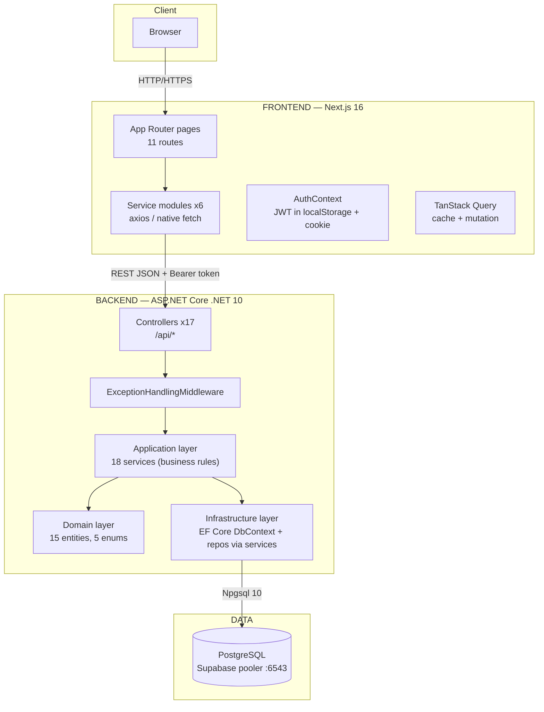
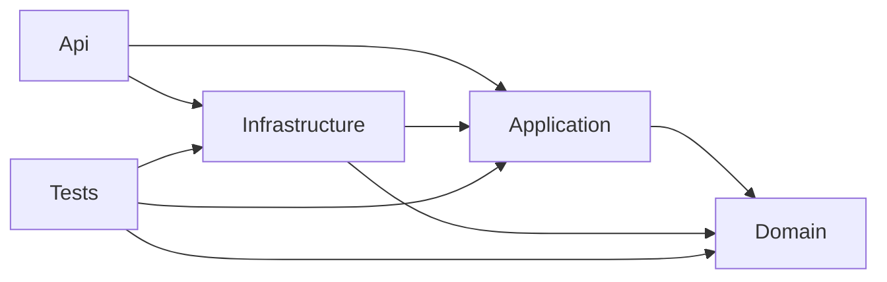
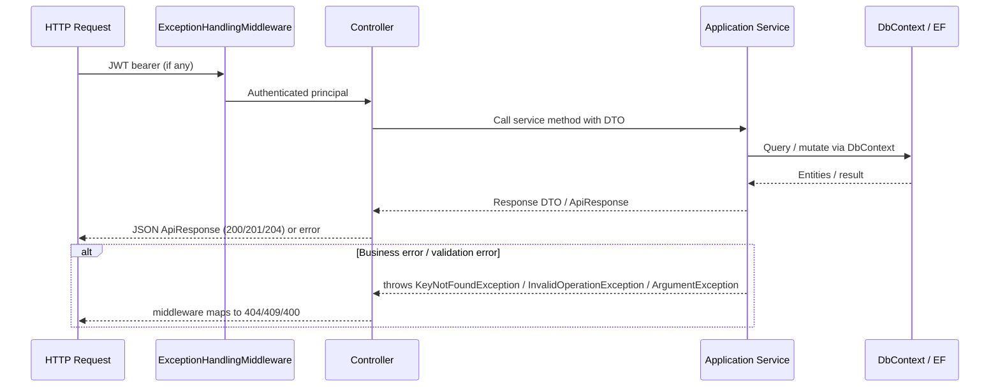
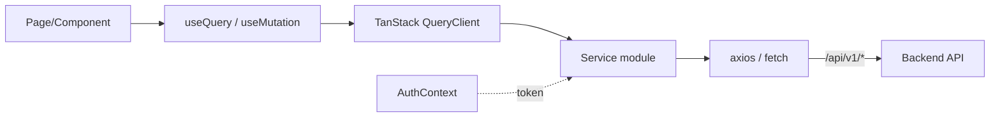

# 02 — System Architecture

> **MASTER DOCUMENTATION** · StudentCenter · PHASE 022A
> Rule applied: never assume, never hallucinate. Unverifiable statements are marked **"Cannot verify from repository."**

## Table of Contents

1. [Architecture at a Glance](#1-architecture-at-a-glance)
2. [High-Level System Diagram](#2-high-level-system-diagram)
3. [Deployment Topology](#3-deployment-topology)
4. [Backend System Design](#4-backend-system-design)
5. [Frontend System Design](#5-frontend-system-design)
6. [Data Layer](#6-data-layer)
7. [Authentication & Identity Flow](#7-authentication--identity-flow)
8. [External Dependencies](#8-external-dependencies)
9. [Integration Contract (Current State)](#9-integration-contract-current-state)
10. [Security Posture](#10-security-posture)

---

## 1. Architecture at a Glance

StudentCenter follows a **client–server monorepo** architecture:

- **Frontend** (Next.js 16 App Router, React 19, Tailwind v4) — server + client rendered web UI.
- **Backend** (ASP.NET Core Web API, Clean Architecture) — REST API over PostgreSQL.
- **Database** (PostgreSQL on Supabase, connection via Npgsql).
- **Identity** (JWT bearer tokens, HS256, stateless — no external identity provider).

There is **no message broker, no cache layer, no CDN, and no separate storage service** wired in the code. File URLs are stored as plain strings; actual file hosting (**"Cannot verify from repository"** — likely Supabase Storage per planning docs, but no upload code exists).

---

## 2. High-Level System Diagram



> ⚠️ **Current contract reality:** the frontend's service modules target base URL `http://localhost:3000/api/v1` (see [09 — Integration Contract](#9-integration-contract-current-state)); the backend exposes `/api/...`. This mismatch breaks integration today.

---

## 3. Deployment Topology

**Planned** (per `docs/Project/MONOREPO_DEPLOYMENT_GUIDE.md`):

| Service | Planned host | Method |
|---|---|---|
| Backend API | `api.studentcenter.com` (env: `NEXT_PUBLIC_API_BASE_URL`) | ASP.NET Core on .NET 10, reverse-proxied |
| Frontend | `studentcenter.com` | Next.js standalone build |
| Database | Supabase PostgreSQL (hosted) | Pooler `aws-0-ap-southeast-1.pooler.supabase.com:6543` |

**Current reality (repository):** No production deployment exists in code. GitHub Actions workflows (`deploy-backend.yml`, `deploy-frontend.yml`) exist but contain **no deploy step** (placeholder comments only) — see [16_CICD_Guide](16_CICD_Guide.md).

**Local run:**

- Backend: `http://localhost:5051` (HTTP), `https://localhost:7187` (HTTPS) — per `launchSettings.json`.
- Frontend: default Next.js port (3000), base URL from `NEXT_PUBLIC_API_BASE_URL`.

---

## 4. Backend System Design

### 4.1 Clean Architecture layers

```
StudentCenter.Domain        — entities, enums, no dependencies
StudentCenter.Application   — DTOs, service interfaces, service implementations (rules)
StudentCenter.Infrastructure— DbContext, EF configurations, seeders, migrations, JWT/Permission/CurrentUser services
StudentCenter.Api           — controllers, middleware, Program.cs (composition root)
StudentCenter.Tests         — xUnit tests (references Application/Domain/Infrastructure)
```

Direction of dependencies (verified from `.csproj` files):



### 4.2 Request pipeline



### 4.3 Error handling contract

Implemented in `ExceptionHandlingMiddleware.cs`:

| Exception type | HTTP status |
|---|---|
| `ArgumentException` / `KeyNotFoundException` | **400** (Bad Request) |
| `UnauthorizedAccessException` | **401** (Unauthorized) |
| `InvalidOperationException` | **409** (Conflict) |
| `DuplicateNameException` (DB unique violation) | **409** (Conflict) |
| `FormatException` | **400** (Bad Request) |
| Anything else | **500** (Internal Server Error) |

Response shape on error: `{ "success": false, "message": "..." }`.

> ⚠️ **Contract mismatch:** `docs/API/API Contract.md` specifies **422** for business errors and **404** for `KeyNotFoundException`; the code returns **409** and **400** respectively. See [25_Known_Issues](25_Known_Issues.md).

---

## 5. Frontend System Design

- **App Router pages** (`src/app/`): 11 routes — `/`, `/login`, `/profile`, `/admin`, `/guru`, `/osis`, `/mading`, `/mading/[id]`, `/ekstrakurikuler`, `/fasilitas`, `/proposal`.
- **Service modules** (`src/services/`): `authService`, `announcementService`, `clubService`, `facilityService`, `proposalService`, `profileService`.
- **Auth state** (`src/contexts/AuthContext.jsx`): holds `token`, `user`, `loading`; persists token to `localStorage` + a **non-HttpOnly** cookie `auth_token` (set via `document.cookie`).
- **Query cache** (`src/lib/queryClient.js`): TanStack Query client with a **fallback** implementation if the package is unavailable.
- **Route protection** (`middleware.js` + `AuthGuard`): presence of `auth_token` cookie gates `/profile` and `/dashboard`; **AuthGuard is bypassed when `NODE_ENV === "development"`** (see [06_Authentication](06_Authentication.md)).

### Frontend data flow



---

## 6. Data Layer

- **Database:** PostgreSQL (Supabase). Connection string targets the **pooler** host (`aws-0-ap-southeast-1.pooler.supabase.com:6543`), dbname `postgres`.
- **ORM:** EF Core 10 with Npgsql 10.0.3.
- **Migrations:** 12, stored in `backend/StudentCenter.Infrastructure/Migrations/` (started 2026-07-27, latest adds Attendance entity 2026-07-30).
- **Indexes/constraints:** unique indexes on `Users.Email`, `AnnouncementReactions`, `Attendances(StudentId, AttendanceDate)`, `ExtracurricularMembers`, `Submissions(AssignmentId, StudentId)`; PKs are UUIDs (`uuid_generate_v4()`); FK deletes are `Restrict`. See [05_Database_Architecture](05_Database_Architecture.md) and [10_Database_ERD](10_Database_ERD.md).

---

## 7. Authentication & Identity Flow

- Backend issues a **JWT (HS256)** with 60-minute expiry on `POST /api/auth/login` using `Email + Password`.
- Principal claims derive from `CurrentUserService`: `NameIdentifier/nameid`, `Email/email`, `GivenName/given_name`, `Role/role`.
- Frontend sends the token in the `Authorization: Bearer` header (Axios interceptor) and keeps it in localStorage + cookie.
- **No refresh-token mechanism** exists; tokens expire after 60 min and the user must log in again.
- Login form validates identifier min 4 chars / password min 6, but the **API only accepts `Email`** — see [06_Authentication](06_Authentication.md).

---

## 8. External Dependencies

| Dependency | Purpose | Verification status |
|---|---|---|
| PostgreSQL (Supabase) | Persistent store | Connection string present in `appsettings.json` |
| NuGet packages | ASP.NET, EF, Npgsql, JWT, Swashbuckle | Verified in csproj |
| npm packages | Next, React, Tailwind, TanStack, RHF, zod | Verified in `package.json` |
| GitHub Actions | CI/CD scaffold | Verified in `.github/workflows/` |
| Local model router (9router) | opencode.json provider | Verified in `opencode.jsonc` |

**Nothing else** (no Redis, no SMTP, no S3/Supabase Storage SDK, no monitoring) is wired in code.

---

## 9. Integration Contract (Current State)

**Documented contract** (`frontend/docs/api-agreement.md`, `docs/API/API Contract.md`):

- Base URL: `/api/v1`
- Auth: `LoginRequest { identifier, password }` (NIS/NISN/NIP)
- Status codes include 422 for business errors

**Implemented backend** (verified in code):

- Base URL: `/api` (no version segment)
- Auth: `LoginRequest { email, password }`
- Business errors → 409

**Resulting breakages** (verified in `frontend/src/`):

| Frontend call | Backend reality | Effect |
|---|---|---|
| `POST /api/v1/auth/login` with `identifier` | `POST /api/auth/login` with `email` | Login 404 + validation failure |
| `GET /api/v1/profile` | No profile endpoint | 404 |
| `GET /api/v1/clubs` | `GET /api/extracurriculars` | 404 |
| `GET /api/v1/facilities/{id}/slots` | No slots endpoint | 404 |
| `PATCH /api/v1/bookings/{id}/status` | `PUT /api/bookings/{id}/status` | 404 |
| Proposal multipart upload | Backend expects JSON `fileUrl` | Mismatch |

Full details: [08_API_Catalog](08_API_Catalog.md) and [26_Technical_Debt](26_Technical_Debt.md).

---

## 10. Security Posture

**Strengths:**

- Role-based authorization enforced at controller level (`[Authorize(Roles = "...")]`).
- Service-level ownership checks on comments, calendar, bookings, clubs.
- Passwords hashed with BCrypt (`PasswordHasher`).
- CORS policy present; Swagger UI gated in development.

**Critical weaknesses (verified):**

1. **Secrets in git (FIXED)** — `appsettings.json` previously had Supabase password + JWT signing key; scrubbed, now `DATABASE_URL` / `JWT_SECRET` env vars. [17_Configuration_Guide](17_Configuration_Guide.md), [26_Technical_Debt](26_Technical_Debt.md).
2. **Hardcoded default admin** password `Admin123!` in seeder (FIXED — now `DEFAULT_ADMIN_PASSWORD` env var). [26_Technical_Debt](26_Technical_Debt.md).
3. **IDOR** — attendance, booking, and submission read endpoints (FIXED — non-admin/teacher callers scoped to own records). [25_Known_Issues](25_Known_Issues.md).
4. **Client-side auth** — token in localStorage + non-HttpOnly cookie; AuthGuard disabled in development. [06_Authentication](06_Authentication.md).
5. **Committed API key** in `opencode.jsonc`. [26_Technical_Debt](26_Technical_Debt.md).
6. **Known high-severity NuGet advisory** `GHSA-v5pm-xwqc-g5wc` (Microsoft.OpenApi 2.0.0). [26_Technical_Debt](26_Technical_Debt.md).

---

*Cross-references: [04_Backend_Architecture](04_Backend_Architecture.md) · [03_Frontend_Architecture](03_Frontend_Architecture.md) · [02_System_Architecture](02_System_Architecture.md) (self) · [docs/Architecture/Architecture.md](../Architecture/Architecture.md)*
