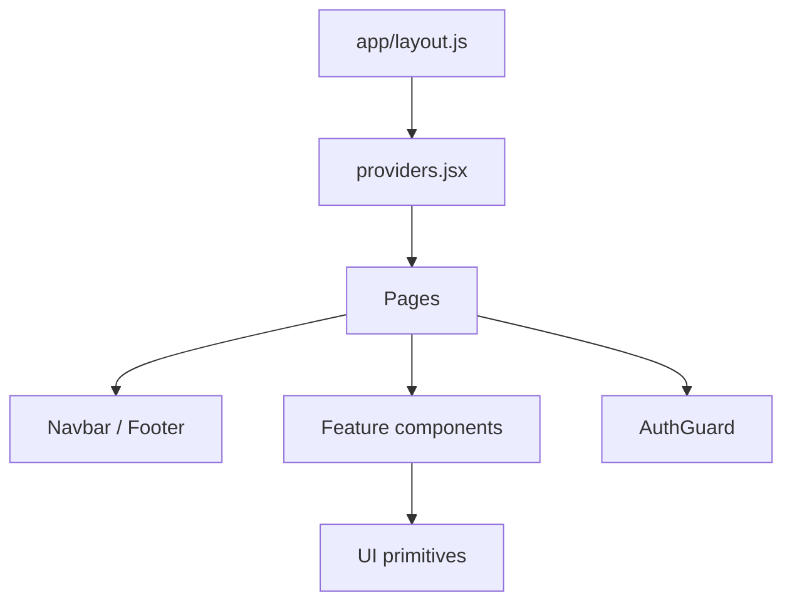
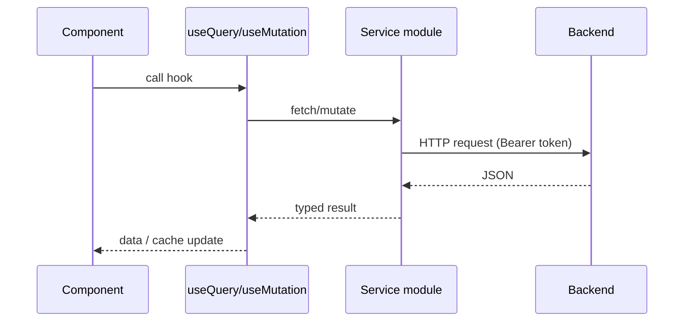

# 03 — Frontend Architecture

> **MASTER DOCUMENTATION** · StudentCenter · PHASE 022A
> Rule applied: never assume, never hallucinate. Unverifiable statements are marked **"Cannot verify from repository."**

## Table of Contents

1. [Overview](#1-overview)
2. [Folder Structure](#2-folder-structure)
3. [Routing & Pages](#3-routing--pages)
4. [Component Architecture](#4-component-architecture)
5. [State Management & Data Fetching](#5-state-management--data-fetching)
6. [Authentication on the Frontend](#6-authentication-on-the-frontend)
7. [Services Layer](#7-services-layer)
8. [Constants & Configuration](#8-constants--configuration)
9. [Forms & Validation](#9-forms--validation)
10. [Styling Approach](#10-styling-approach)
11. [Known Integration Issues](#11-known-integration-issues)

---

## 1. Overview

The frontend is a **Next.js 16 App Router** application (React 19.2.4, Tailwind CSS v4, TanStack Query). It is the student-facing web UI for StudentCenter and lives in `frontend/`.

Verified from `frontend/package.json`:

| Package | Version |
|---|---|
| `next` | 16.2.12 |
| `react` / `react-dom` | 19.2.4 |
| `tailwindcss` | ^4.0.0 |
| `@tanstack/react-query` | 5.66.0 |
| `axios` | 1.7.9 |
| `react-hook-form` | 7.54.2 |
| `zod` | 3.24.2 |
| `@hookform/resolvers` | 3.10.0 |
| `lucide-react` | 0.475.0 |
| `motion` | ^11 (used by some components) |

> ⚠️ Note: some components (`src/components/home/`) reference a `motion` import for animation; the package is present.

---

## 2. Folder Structure

```
frontend/
├── middleware.js              # route protection (cookie presence check)
├── next.config.mjs
├── package.json
├── src/
│   ├── app/                   # App Router (pages + layout + providers)
│   │   ├── layout.js          # root layout: lang="id", Geist fonts, metadata
│   │   ├── page.js            # landing page (Hero, sections)
│   │   ├── providers.jsx      # QueryClientProvider + AuthProvider
│   │   ├── login/page.js
│   │   ├── profile/page.js
│   │   ├── admin/page.js
│   │   ├── guru/page.js
│   │   ├── osis/page.js
│   │   ├── mading/page.js
│   │   ├── mading/[id]/page.js
│   │   ├── ekstrakurikuler/page.js
│   │   ├── fasilitas/page.js
│   │   └── proposal/page.js
│   ├── components/            # ~40 shared components (2 identical 'home/' sets)
│   ├── config/
│   │   ├── api.js             # BASE_URL (/api/v1), timeout, headers
│   │   └── app.js             # APP_NAME, UPLOAD_LIMIT, TOKEN_COOKIE_NAME
│   ├── constants/
│   │   ├── apiRoutes.js       # endpoint route map
│   │   └── userRoles.js       # role labels/colors
│   ├── contexts/
│   │   └── AuthContext.jsx    # auth state + token persistence
│   ├── features/
│   │   └── auth/
│   │       ├── LoginForm.jsx
│   │       ├── loginSchema.js
│   │       └── useLogin.js
│   ├── hooks/
│   │   └── useAuth.js
│   ├── lib/
│   │   ├── api.js             # axios client + native fetch fallback
│   │   ├── queryClient.js     # TanStack client + fallback
│   │   └── ensure-assets.js
│   └── services/              # 6 modules (see section 7)
└── docs/                      # frontend planning docs
```

---

## 3. Routing & Pages

`middleware.js` protects `/profile` and `/dashboard` by checking for the `auth_token` cookie **presence only** (no signature/expiry verification on the server side).

| Route | Component/page | Purpose | Protected? |
|---|---|---|---|
| `/` | `src/app/page.js` | Landing: Navbar, Hero, ExtracurricularSection, MadingSection, FacilityCatalogSection, Footer | No |
| `/login` | `login/page.js` + `LoginForm` | Login | No (redirects if logged in) |
| `/profile` | `profile/page.js` | User profile | Yes |
| `/admin` | `admin/page.js` | Admin dashboard | Yes |
| `/guru` | `guru/page.js` | Teacher dashboard | Yes |
| `/osis` | `osis/page.js` | OSIS dashboard | Yes |
| `/mading` | `mading/page.js` | Announcement list | Yes |
| `/mading/[id]` | `mading/[id]/page.js` | Announcement detail | Yes |
| `/ekstrakurikuler` | `ekstrakurikuler/page.js` | Clubs list | Yes |
| `/fasilitas` | `fasilitas/page.js` | Facility booking | Yes |
| `/proposal` | `proposal/page.js` | Proposal submission | Yes |

> ⚠️ **Dev bypass:** `AuthGuard` (used by protected pages) is skipped when `NODE_ENV === "development"`, so route protection is effectively disabled in local dev. See [06_Authentication](06_Authentication.md).

---

## 4. Component Architecture

- **~40 shared components** under `src/components/`, organized by feature (`announcements/`, `extracurricular/`, `facilities/`, `home/`, `ui/`, `layout/`).
- ⚠️ **Duplicate set:** there are **two identical `home/` component sets** (`src/components/home/` and a second copy) — a duplication debt. See [26_Technical_Debt](26_Technical_Debt.md).
- `layout/` includes `Navbar`, `Footer`, and `AuthGuard`.
- Root layout (`layout.js`) sets `lang="id"`, Geist font families, and app metadata (`title`/`description`).

Component hierarchy (illustrative):



---

## 5. State Management & Data Fetching

**TanStack Query** is the primary server-state solution:

- `src/lib/queryClient.js` — builds a `QueryClient` (default options) and exposes a **fallback** client used when `@tanstack/react-query` is unavailable (defensive design).
- `src/app/providers.jsx` — wraps the app in `<QueryClientProvider client={queryClient}>` plus `<AuthProvider>`.



**Caching fallback nuance:** because the backend response shape is `ApiResponse { success, message, data }`, the query layer must unwrap `.data` — see [13_Request_Response_Flow](13_Request_Response_Flow.md).

---

## 6. Authentication on the Frontend

See [06_Authentication](06_Authentication.md) for the full flow. Key implementation facts:

- `AuthContext.jsx` stores `token`, `user`, `loading`.
- Token persistence: `localStorage.setItem("token", ...)` **and** `document.cookie` with name `auth_token` (from `config/app.js`), **not** `HttpOnly`.
- `AuthGuard` redirects unauthenticated users to `/login` (unless development mode).
- Login flow: `useLogin.js` → `POST /api/v1/auth/login` → on success stores token + user → redirects to `callbackUrl ?? "/profile"`.
- **Known issue:** on mount, AuthContext fetches `/api/v1/profile` (or `/auth/me`?) to restore the user — see [08_API_Catalog](08_API_Catalog.md) for which endpoints exist.

---

## 7. Services Layer

Six modules in `src/services/` wrap HTTP calls:

| Module | Responsibility | Uses routes from |
|---|---|---|
| `authService` | login, fetch current user | `apiRoutes.AUTH` |
| `announcementService` | announcements CRUD, comments, reactions | `apiRoutes.ANNOUNCEMENTS` |
| `clubService` | clubs/members | `apiRoutes.CLUBS` |
| `facilityService` | facilities, bookings | `apiRoutes.BOOKINGS` |
| `proposalService` | proposals | (proposal routes) |
| `profileService` | profile read/update | `apiRoutes.PROFILE` |

Transport (`src/lib/api.js`): Axios instance with base URL from `config/api.js`, 15s timeout, JSON headers; **falls back to native `fetch`** when axios is unavailable.

⚠️ **All six modules call `/api/v1/...` routes that mostly do not exist on the backend** — see section 11 and [08_API_Catalog](08_API_Catalog.md).

---

## 8. Constants & Configuration

| File | Key values |
|---|---|
| `src/config/api.js` | `BASE_URL = "/api/v1"`, `TIMEOUT = 15000`, JSON headers |
| `src/config/app.js` | `APP_NAME = "Student Center"`, `UPLOAD_LIMIT = 2MB`, `TOKEN_COOKIE_NAME = "auth_token"` |
| `src/constants/apiRoutes.js` | `AUTH.LOGIN` (`/auth/login`), `AUTH.PROFILE` (`/profile`), `ANNOUNCEMENTS`, `CLUBS`, `BOOKINGS`, ... |
| `src/constants/userRoles.js` | Roles `Student`, `OSIS`, `Teacher`, `Admin` + labels/colors |

---

## 9. Forms & Validation

- **Login** (`features/auth/`):
  - `loginSchema.js` (zod): `identifier` min 4 chars, `password` min 6 chars.
  - `LoginForm.jsx` (react-hook-form + zodResolver).
  - `useLogin.js`: mutation → login API → callback URL.
- ⚠️ **Contract mismatch:** schema validates `identifier` (NIS/NISN/NIP) but backend login expects `email`. See [25_Known_Issues](25_Known_Issues.md).
- Other forms (booking, proposal, announcement) use the same RHF+zod pattern (verified in feature components).

---

## 10. Styling Approach

- **Tailwind CSS v4** with utility-first classes.
- **Geist** fonts (GeistSans/GeistMono) via `next/font` in the root layout.
- Consistent design tokens: indigo/primary accent, rounded cards, shadow surfaces (verified across components).
- `lucide-react` icons.

---

## 11. Known Integration Issues

These are **verified from code** and block the frontend from working against the backend:

1. **Base path mismatch:** `config/api.js` uses `/api/v1`; backend serves `/api`. 
2. **Login field mismatch:** frontend sends `identifier`; backend requires `email`.
3. **Missing endpoints called by frontend:** `/profile`, `/clubs`, `/facilities/{id}/slots`.
4. **HTTP method mismatch:** `PATCH /bookings/{id}/status` vs backend `PUT`.
5. **Proposal upload:** frontend posts `multipart/form-data`; backend DTO expects JSON `fileUrl`.
6. **Auth restore:** AuthContext relies on a profile endpoint that does not exist.
7. **Route protection gap:** dev bypass in AuthGuard.

| Severity | Count | Examples |
|---|---|---|
| Critical (blocks login) | 2 | base path, login field |
| High (breaks features) | 5 | profile, clubs, slots, PATCH, proposal upload |
| Medium | 2 | auth restore, dev bypass |

See [26_Technical_Debt](26_Technical_Debt.md) for remediation priorities.

---

*Cross-references: [02_System_Architecture](02_System_Architecture.md) · [06_Authentication](06_Authentication.md) · [08_API_Catalog](08_API_Catalog.md) · [26_Technical_Debt](26_Technical_Debt.md) · [frontend/docs/student-center.md](../frontend/docs/student-center.md)*
