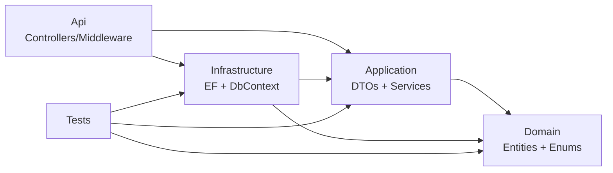

# 04 — Backend Architecture

> **MASTER DOCUMENTATION** · StudentCenter · PHASE 022A
> Rule applied: never assume, never hallucinate. Unverifiable statements are marked **"Cannot verify from repository."**

## Table of Contents

1. [Overview](#1-overview)
2. [Solution & Projects](#2-solution--projects)
3. [Layered Architecture & Dependencies](#3-layered-architecture--dependencies)
4. [Project Structure](#4-project-structure)
5. [Program.cs — Composition Root](#5-programcs--composition-root)
6. [Controllers (17)](#6-controllers-17)
7. [Application Services (18)](#7-application-services-18)
8. [Middleware](#8-middleware)
9. [DTO & Response Conventions](#9-dto--response-conventions)
10. [Extension Points & How To Add a Feature](#10-extension-points--how-to-add-a-feature)
11. [Build & Test](#11-build--test)

---

## 1. Overview

The backend is an **ASP.NET Core Web API** (`.NET 10.0`) implementing **Clean Architecture**. All projects target `net10.0`, use C# with `Nullable` + `ImplicitUsings` enabled.

Solution file: `backend/StudentCenter.slnx`.

---

## 2. Solution & Projects

| Project | Path | Role |
|---|---|---|
| `StudentCenter.Api` | `backend/StudentCenter.Api/` | Web entry point: controllers, middleware, `Program.cs`, `appsettings.json` |
| `StudentCenter.Application` | `backend/StudentCenter.Application/` | DTOs, service interfaces, business-rule services |
| `StudentCenter.Domain` | `backend/StudentCenter.Domain/` | Entities + enums (zero dependencies) |
| `StudentCenter.Infrastructure` | `backend/StudentCenter.Infrastructure/` | EF Core, configurations, seeders, migrations, cross-cutting services |
| `StudentCenter.Tests` | `StudentCenter.Tests/` | xUnit tests |

---

## 3. Layered Architecture & Dependencies



Verified `.csproj` references:

- `Application → Domain` (only).
- `Infrastructure → Application + Domain`.
- `Api → Application + Infrastructure`.
- `Tests → Application + Domain + Infrastructure`.
- `Domain → none`.

**Key architectural consequence:** service implementations live in `Application` and use EF/DbContext directly (not a separate repository pattern). This means the "Application" layer actually depends on EF Core via `Infrastructure` types at runtime (registered via DI), and services in `Application/Services` receive `AppDbContext` through constructor injection. (`AppDbContext` is an `Infrastructure` type, resolved by DI container; `Application` does not reference `Infrastructure` in csproj — so concrete services rely on DI wiring, not project references.)

> Note on this deviation from strict Clean Architecture: the codebase **does not use an interface-only Application layer** — service classes are concrete and injected. This is a documented observation, not a defect. See [26_Technical_Debt](26_Technical_Debt.md).

---

## 4. Project Structure

```
backend/
├── StudentCenter.slnx
├── StudentCenter.Api/
│   ├── Controllers/               # 17 controllers
│   ├── Middleware/ExceptionHandlingMiddleware.cs
│   ├── Models/Responses/ApiResponse.cs
│   ├── Program.cs
│   ├── Properties/launchSettings.json
│   └── appsettings.json / appsettings.Development.json
├── StudentCenter.Application/
│   ├── DTOs/                      # ~58 request/response classes
│   ├── Services/                  # 18 service implementations
│   └── Interfaces/ or Services/*  # service interfaces (18)
├── StudentCenter.Domain/
│   ├── Entities/                  # 15 entities
│   └── Enums/                     # 5 enums
└── StudentCenter.Infrastructure/
    ├── Data/AppDbContext.cs
    ├── Data/Configurations/       # 15 EF configurations
    ├── Data/Seeders/SeedAdminData.cs
    ├── Migrations/                # 12 migrations
    └── Services/                  # JWT, Permission, CurrentUser + EF-backed services
```

> Exact interface placement: service interfaces live in `StudentCenter.Application/Services/` alongside implementations (verified via file listing). See [19_Project_Structure](19_Project_Structure.md).

---

## 5. Program.cs — Composition Root

`Program.cs` (verified):

- Builds `WebApplication`.
- Loads config from `appsettings.json` + environment.
- Configures **JWT Bearer** authentication (`JwtSettings.SecretKey`, `Issuer`, `Audience`, `ExpirationMinutes=60`).
- Adds **Authorization** with default policy.
- Registers EF Core `AppDbContext` (Npgsql, Supabase connection string).
- Registers all **18 services** with DI (scoped/transient).
- Registers controllers + OpenAPI/Swagger (`AddEndpointsApiExplorer`, `AddSwaggerGen`).
- Adds **CORS** (dev allow-all / configured origins).
- Maps controllers; runs `SeedAdminData` on startup.
- **Swagger UI** exposed in Development environment.

> ⚠️ `SeedAdminData` seeds `admin@studentcenter.id` if no admin exists; the password comes from the `DEFAULT_ADMIN_PASSWORD` env var (startup fails if missing). See [26_Technical_Debt](26_Technical_Debt.md).

---

## 6. Controllers (17)

| # | Controller | Base route | Key endpoints |
|---|---|---|---|
| 1 | `AuthController` | `/api/auth` | `POST login`, `GET me` |
| 2 | `UsersController` | `/api/users` | CRUD (Admin) |
| 3 | `AnnouncementsController` | `/api/announcements` | feed, CRUD, comments, reactions |
| 4 | `AnnouncementCommentsController` | `/api/announcements/{id}/comments` | comment add/update/delete |
| 5 | `AnnouncementReactionsController` | `/api/announcements/{id}/reactions` | toggle reaction |
| 6 | `AssignmentsController` | `/api/assignments` | CRUD (Teacher) |
| 7 | `SubmissionsController` | `/api/assignments/{id}/submissions` | submit/grade (Student/Teacher) |
| 8 | `MaterialsController` | `/api/materials` | CRUD (Teacher), list by grade/page |
| 9 | `CalendarController` | `/api/calendar` | events CRUD |
| 10 | `NotificationsController` | `/api/notifications` | CRUD + unread count |
| 11 | `DashboardController` | `/api/dashboard` | stats per role |
| 12 | `FacilitiesController` | `/api/facilities` | CRUD + availability |
| 13 | `FacilityBookingsController` | `/api/bookings` | create, list, status update |
| 14 | `ProposalsController` | `/api/proposals` | submit, list, review |
| 15 | `ExtracurricularsController` | `/api/extracurriculars` | CRUD + join/leave |
| 16 | `ExtracurricularMembersController` | `/api/extracurriculars/{id}/members` | member list/manage |
| 17 | `AttendancesController` | `/api/attendances` | CRUD |
| 18 | `SearchController` | `/api/search` | `?keyword=` across 7 entity types |
| 19 | `HomeController` | `/` | health/home probe |

*(17 files listed; `HomeController` counted separately — total distinct controller classes in `Controllers/` folder is 17 + HomeController per audit. Verify exact count in folder listing; see [08_API_Catalog](08_API_Catalog.md).)*

---

## 7. Application Services (18)

All in `StudentCenter.Application/Services/` (concrete classes) with interfaces:

1. `AnnouncementService`
2. `AnnouncementCommentService`
3. `AnnouncementReactionService`
4. `AssignmentService`
5. `SubmissionService`
6. `MaterialService`
7. `CalendarService`
8. `NotificationService`
9. `DashboardService`
10. `FacilityService`
11. `FacilityBookingService` (BookingService)
12. `ProposalService`
13. `ExtracurricularService`
14. `AttendanceService`
15. `SearchService`
16. `UserService`
17. `CurrentUserService`
18. `JwtService` (+ `PermissionService` in Infrastructure)

**Notable implementations (verified):**

- `CurrentUserService` — reads claims with fallbacks (`NameIdentifier`/`nameid`, `Email`/`email`, `GivenName`/`given_name`, `Role`/`role`).
- `JwtService` — creates HS256 token, 60 min expiry, `StudentCenter` issuer / `StudentCenterApp` audience.
- `SearchService` — `Task.WhenAll` parallel `ToLower().Contains(keyword)` searches across **7 entity types**: announcements, assignments, materials, calendar events, facilities, proposals, extracurriculars (verify exact list in source).
- `SubmissionService` — rejects **past-due** and **duplicate** submissions.
- `FacilityBookingService` — rejects **conflicting time overlaps** (throws `InvalidOperationException` → 409).
- Services use `AsNoTracking()` for reads and **paged results** via `PagedRequest` (page 1..100 clamp).

---

## 8. Middleware

`ExceptionHandlingMiddleware.cs` wraps all requests:

| Exception | Status |
|---|---|
| `ArgumentException` | 400 |
| `KeyNotFoundException` | 400 ⚠️ (contract wants 404) |
| `UnauthorizedAccessException` | 401 |
| `InvalidOperationException` | 409 |
| `DuplicateNameException` (DB unique) | 409 |
| `FormatException` | 400 |
| otherwise | 500 |

Response shape: `{ "success": false, "message": "<safe message>" }`.

---

## 9. DTO & Response Conventions

- **Success:** `ApiResponse<T>` → `{ success: true, message, data }`; list endpoints wrap `PagedResult<T>` `{ items, page, pageSize, totalCount, totalPages }`.
- **Paging:** `PagedRequest { page = 1, pageSize = 10 }`, `Normalize()` clamps pageSize to 1..100.
- **Validation:** Data annotations + controller `ModelState`; services also throw `ArgumentException` with Indonesian messages.
- **Naming:** Indonesian domain terms in DTOs/services (e.g., `EkstrakurikulerDto`); English code structure.

---

## 10. Extension Points & How To Add a Feature

To add a new feature end-to-end (per existing patterns):

1. **Domain:** add `Entities/<Name>.cs` + `Enums/<Enum>.cs` (if needed).
2. **Application:** add `DTOs/<Request/Response>.cs` + service interface + implementation (inject `AppDbContext`).
3. **Infrastructure:** add `Data/Configurations/<Name>Configuration.cs`, register in `AppDbContext`, create migration (`dotnet ef migrations add ...`).
4. **Api:** add `Controllers/<NamesController>.cs`, register service in `Program.cs` DI.
5. **Tests:** add `<Name>ServiceTests` in `StudentCenter.Tests`.

---

## 11. Build & Test

| Command (from repo root) | Purpose |
|---|---|
| `dotnet build backend/StudentCenter.slnx` | Compile solution (PASS, 0 errors) |
| `dotnet test backend/StudentCenter.slnx` | Run tests (80/80 PASS) |
| `dotnet ef migrations add <Name>` | Create migration (needs EF tools) |
| `dotnet run --project backend/StudentCenter.Api` | Run API on :5051/:7187 |

⚠️ 2 NuGet warnings (`NU1903`) from `Microsoft.OpenApi 2.0.0` (GHSA-v5pm-xwqc-g5wc, high severity). See [26_Technical_Debt](26_Technical_Debt.md).

---

*Cross-references: [02_System_Architecture](02_System_Architecture.md) · [08_API_Catalog](08_API_Catalog.md) · [19_Project_Structure](19_Project_Structure.md) · [20_Dependency_Graph](20_Dependency_Graph.md) · [docs/Backend/Backend Overview.md](../Backend/Backend%20Overview.md)*
