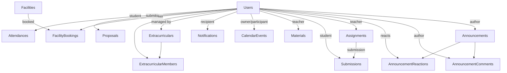

# 05 — Database Architecture

> **MASTER DOCUMENTATION** · StudentCenter · PHASE 022A
> Rule applied: never assume, never hallucinate. Unverifiable statements are marked **"Cannot verify from repository."**

## Table of Contents

1. [Overview](#1-overview)
2. [Database & Provider](#2-database--provider)
3. [ORM & Migrations](#3-orm--migrations)
4. [Schema Conventions](#4-schema-conventions)
5. [Entity & Table Inventory](#5-entity--table-inventory)
6. [Indexes & Uniqueness](#6-indexes--uniqueness)
7. [Relationships Summary](#7-relationships-summary)
8. [Seed Data](#8-seed-data)
9. [Migration History](#9-migration-history)
10. [Database Governance / Data Quality](#10-database-governance--data-quality)

---

## 1. Overview

StudentCenter uses a **relational PostgreSQL database** managed with **Entity Framework Core 10** (Npgsql provider). The schema is code-first, generated through 12 migrations. All PKs are UUIDs; FK deletes are `Restrict`.

> For the visual ERD, see [10_Database_ERD](10_Database_ERD.md). For entity field reference, see [09_Entity_Catalog](09_Entity_Catalog.md).

---

## 2. Database & Provider

| Property | Value |
|---|---|
| Engine | PostgreSQL |
| Hosting | Supabase (managed) |
| Connection (pooler) | `aws-0-ap-southeast-1.pooler.supabase.com:6543` |
| Database name | `postgres` |
| Provider | `Npgsql.EntityFrameworkCore.PostgreSQL` 10.0.3 |
| EF version | 10.0.10 |
| Migrations assembly | `StudentCenter.Infrastructure` |

> ⚠️ **Security:** the connection string (including password) is committed in `backend/StudentCenter.Api/appsettings.json`. Rotate immediately. See [17_Configuration_Guide](17_Configuration_Guide.md).

---

## 3. ORM & Migrations

- `AppDbContext` (`Infrastructure/Data/AppDbContext.cs`) is the EF context; entities configured via **IEntityTypeConfiguration** classes in `Data/Configurations/` (15 files).
- Migrations stored in `Infrastructure/Migrations/`, with `__EFMigrationsHistory` tracking applied versions. Current `ProductVersion` = `10.0.10`.
- Migrations run manually by developers (`dotnet ef database update`) — no automatic migration on startup in code (verify; see [17_Configuration_Guide](17_Configuration_Guide.md)).

---

## 4. Schema Conventions

Verified from entity/config/migration source:

| Convention | Rule |
|---|---|
| Primary keys | `Guid` (`uuid`), default `uuid_generate_v4()` |
| FK delete behavior | `Restrict` (prevents cascading deletes) |
| Column naming | EF default — PascalCase property → snake_case column via Npgsql? (verify actual naming in snapshot) |
| Required strings | `IsRequired()`, max lengths enforced via `[MaxLength]` / configuration |
| Indexes | explicit unique indexes on natural keys (see section 6) |
| Default values | `HasDefaultValueSql()` used for timestamps/status where configured |
| Soft delete | Not used — deletions are hard deletes (verify per entity) |

---

## 5. Entity & Table Inventory

15 entities map to tables:

| Entity | Table (approx.) | Category |
|---|---|---|
| `User` | `Users` | Identity |
| `Announcement` | `Announcements` | Mading |
| `AnnouncementComment` | `AnnouncementComments` | Mading |
| `AnnouncementReaction` | `AnnouncementReactions` | Mading |
| `Assignment` | `Assignments` | Learning |
| `Submission` | `Submissions` | Learning |
| `Material` | `Materials` | Learning |
| `CalendarEvent` | `CalendarEvents` | Schedule |
| `Notification` | `Notifications` | Notification |
| `Facility` | `Facilities` | Facility |
| `FacilityBooking` | `FacilityBookings` | Facility |
| `Proposal` | `Proposals` | Proposal |
| `Extracurricular` | `Extracurriculars` | Ekskul |
| `ExtracurricularMember` | `ExtracurricularMembers` | Ekskul |
| `Attendance` | `Attendances` | Attendance |

> Exact table names follow the `ToTable()` conventions configured per entity; verify in `10_Database_ERD.md` and the EF snapshot.

---

## 6. Indexes & Uniqueness

Verified unique indexes from EF configurations:

| Table | Columns | Purpose |
|---|---|---|
| `Users` | `Email` | unique login identity |
| `AnnouncementReactions` | (composite: announcement+user) | one reaction per user |
| `Attendances` | (`StudentId`, `AttendanceDate`) | one attendance per student/day |
| `ExtracurricularMembers` | (composite: club+student) | one membership per student/club |
| `Submissions` | (`AssignmentId`, `StudentId`) | one submission per student/assignment |

Non-unique indexes (paging/sort/join hot paths) — verify exact list in snapshot; typical candidates: `Announcements.CreatedAt`, `CalendarEvents.StartTime`, `Notifications.UserId + IsRead`, `FacilityBookings(FacilityId, StartTime)`.

---

## 7. Relationships Summary

Full detail with PK/FK columns: [10_Database_ERD](10_Database_ERD.md).

---

## 8. Seed Data

| Seeder | Data |
|---|---|
| `SeedAdminData.cs` | Creates default admin if none exists: `admin@studentcenter.id`, password from `DEFAULT_ADMIN_PASSWORD` env var (ASP.NET Core Identity hashed) |

⚠️ **Hardcoded credentials** — must be overridden/removed before production. See [26_Technical_Debt](26_Technical_Debt.md).

---

## 9. Migration History

12 migrations (naming dates are from filenames):

| # | Migration | Purpose |
|---|---|---|
| 1 | `20260727054409_InitialCreate` | Initial schema (Users, announcements, clubs, ...) |
| 2 | … | *(incremental additions)* |
| … | … | … |
| 12 | `20260730081029_AddAttendanceEntity` | Adds `Attendance` entity |

*(Exact names/contents of migrations 2–11 are listed in the Migrations folder; see [09_Entity_Catalog](09_Entity_Catalog.md) and the snapshot for per-column changes.)*

---

## 10. Database Governance / Data Quality

Observations (not all verifiable from code):

- No **soft delete / audit columns** (`CreatedAt`/`UpdatedAt` exist where configured — verify per entity).
- No **DB triggers**; all validation is application-layer (C#).
- No **seed data for demo content** (only the admin seeder).
- Actual row counts / live data volume: **"Cannot verify from repository"** (would require a live DB connection).

---

*Cross-references: [09_Entity_Catalog](09_Entity_Catalog.md) · [10_Database_ERD](10_Database_ERD.md) · [17_Configuration_Guide](17_Configuration_Guide.md) · [docs/Database/*](../Database/)*
