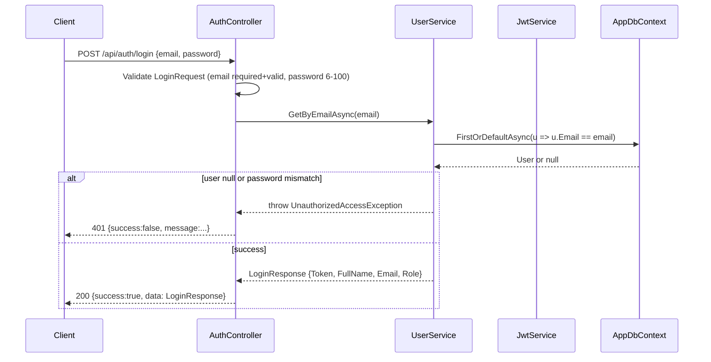

# 06 — Authentication

> **MASTER DOCUMENTATION** · StudentCenter · PHASE 022A
> Rule applied: never assume, never hallucinate. Unverifiable statements are marked **"Cannot verify from repository."**

## Table of Contents

1. [Authentication Model](#1-authentication-model)
2. [Login Flow (Backend)](#2-login-flow-backend)
3. [Token Format](#3-token-format)
4. [Login Flow (Frontend)](#4-login-flow-frontend)
5. [Token Storage & Transmission](#5-token-storage--transmission)
6. [Session Lifecycle & Expiry](#6-session-lifecycle--expiry)
7. [Restoring Session / Current User](#7-restoring-session--current-user)
8. [Security Assessment](#8-security-assessment)
9. [Contract Mismatches](#9-contract-mismatches)

---

## 1. Authentication Model

- **Type:** Stateless **JWT Bearer** authentication (HS256).
- **Library:** `Microsoft.AspNetCore.Authentication.JwtBearer` 10.0.10.
- **Credentials:** Email + password (backend). Password verified against **BCrypt** hash stored on `User`.
- **No refresh tokens, no external identity provider, no OAuth.**

---

## 2. Login Flow (Backend)

`POST /api/auth/login` (`AuthController` + `JwtService`):



**LoginRequest validation (verified):**
- `Email` — required, valid email format, max 256.
- `Password` — required, length 6–100.

---

## 3. Token Format

| Claim / setting | Value |
|---|---|
| Algorithm | HS256 |
| Secret | from config `Jwt:SecretKey` (⚠️ committed; see [17_Configuration_Guide](17_Configuration_Guide.md)) |
| Issuer | `StudentCenter` |
| Audience | `StudentCenterApp` |
| Expiry | 60 minutes (`Jwt:ExpirationMinutes`) |
| Claims | `sub`/`nameid` (user id), `email`, `given_name`/`name`, `role` |

**CurrentUserService claim fallbacks (verified):**

| Logical value | Claim types tried |
|---|---|
| User id | `NameIdentifier`, `nameid` |
| Email | `Email`, `email` |
| Full name | `GivenName`, `given_name` |
| Role | `Role`, `role` |

---

## 4. Login Flow (Frontend)

`features/auth/` (`LoginForm.jsx`, `useLogin.js`, `loginSchema.js`):

```mermaid
sequenceDiagram
    participant U as User
    participant LF as LoginForm
    participant UL as useLogin
    participant AS as authService
    participant API as Backend /api/v1/auth/login

    U->>LF: enter identifier + password
    LF->>LF: zod validate (identifier >=4, password >=6)
    LF->>UL: mutation.mutate()
    UL->>AS: login({identifier, password})
    AS->>API: POST /api/v1/auth/login
    alt success
        API-->>AS: {token, fullName, email, role}
        AS-->>UL: data
        UL->>AuthContext: setToken/setUser; save localStorage + cookie
        UL-->>LF: redirect(callbackUrl ?? '/profile')
    else failure
        API-->>AS: 4xx error
        UL-->>LF: show error message
    end
```

⚠️ **Frontend sends `identifier`; backend expects `email`.** Login is currently **broken** until the contract is aligned (see section 9).

---

## 5. Token Storage & Transmission

- **Backend:** token is returned in the login response body only (no `Set-Cookie` from backend; verify).
- **Frontend (`AuthContext.jsx`):**
  - Stores token in `localStorage` under `token`.
  - Also writes cookie `auth_token` via `document.cookie` (**NOT HttpOnly**).
  - Axios interceptor attaches `Authorization: Bearer <token>` on requests.

---

## 6. Session Lifecycle & Expiry

- Token valid **60 minutes**.
- No refresh mechanism → after expiry the frontend receives `401` and the user must log in again.
- Frontend has no expiry pre-check; it relies on server `401` responses (verify exact handling in `api.js` interceptor).

---

## 7. Restoring Session / Current User

- Backend: `GET /api/auth/me` returns current user from claims (requires valid token).
- Frontend: on app mount, `AuthContext` reads the persisted token and attempts to fetch the current user. **But** the frontend service calls a `/profile` endpoint which **does not exist** on the backend → session restore fails → repeated login prompts / route guard issues.

---

## 8. Security Assessment

| Item | Status |
|---|---|
| Password hashing (BCrypt) | ✅ |
| JWT signing key | ⚠️ was committed to repo — rotate; now `JWT_SECRET` env var |
| Default admin password | ✅ now from `DEFAULT_ADMIN_PASSWORD` env var (was hardcoded `Admin123!`) |
| Token in `localStorage` | ⚠️ XSS-exposable |
| Cookie `HttpOnly` | ❌ not set |
| AuthGuard dev bypass (`NODE_ENV === "development"`) | ⚠️ disables protection locally |
| Token revocation / blacklist | ❌ none (stateless) |
| Rate limiting on login | ❌ none (verify) |

---

## 9. Contract Mismatches

| Aspect | Documented contract | Backend (code) | Frontend (code) |
|---|---|---|---|
| Login field | `identifier` (NIS/NISN/NIP) | `email` | `identifier` |
| Base path | `/api/v1` | `/api` | `/api/v1` |
| Current-user endpoint | `/auth/me` | `GET /api/auth/me` | calls `/profile` |
| Unauthorized shape | per contract | `401 {success:false,message}` | expects axios error |

**Resolution roadmap:** align `config/api.js` base URL, change login field to `email` (or add `identifier` support + NIS/NISN/NIP columns on `User`), add `/profile` backend endpoint or point frontend at `/auth/me`. Prioritize in [26_Technical_Debt](26_Technical_Debt.md).

---

*Cross-references: [07_Authorization](07_Authorization.md) · [08_API_Catalog](08_API_Catalog.md) · [17_Configuration_Guide](17_Configuration_Guide.md) · [docs/API/API Contract.md](../API/API%20Contract.md)*
