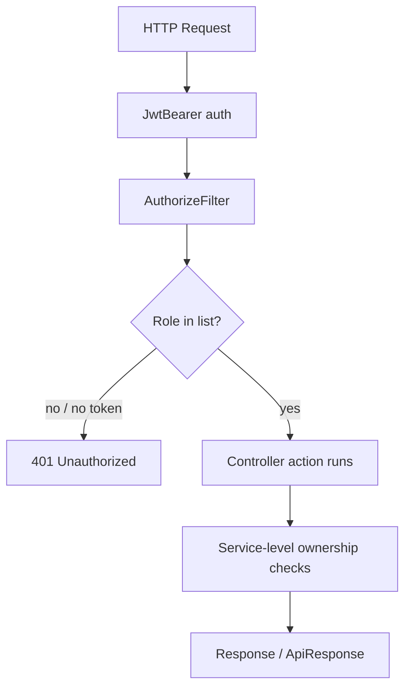

# 07 — Authorization

> **MASTER DOCUMENTATION** · StudentCenter · PHASE 022A
> Rule applied: never assume, never hallucinate. Unverifiable statements are marked **"Cannot verify from repository."**

## Table of Contents

1. [Authorization Model](#1-authorization-model)
2. [Roles](#2-roles)
3. [How Authorization Is Enforced](#3-how-authorization-is-enforced)
4. [Endpoint × Role Matrix](#4-endpoint--role-matrix)
5. [Service-Level Ownership Checks](#5-service-level-ownership-checks)
6. [Gaps & Risks](#6-gaps--risks)

---

## 1. Authorization Model

- **Type:** Role-based authorization via `[Authorize(Roles = "...")]` on controllers/actions + `[Authorize]` defaults.
- Token claims (`role`) are mapped to `UserRole` enum values at the controller boundary (`Role.Parse` / `Enum.TryParse`).
- Where no role is specified, `[Authorize]` allows **any authenticated** user.

---

## 2. Roles

Enum `UserRole` (`StudentCenter.Domain/Enums`):

| Value | Name | Int | Typical UI label |
|---|---|---|---|
| Admin | `Admin` | 0 | Administrator |
| Teacher | `Teacher` | 1 | Guru |
| Student | `Student` | 2 | Siswa |
| OSIS | `OSIS` | 3 | OSIS |

`frontend/src/constants/userRoles.js` mirrors these four labels for the UI.

> Note: planning docs mention "Pembina Ekskul" (club advisor) but it is modeled as a `ManagedByUserId` relationship on `Extracurricular`, **not** a fifth role. See [26_Technical_Debt](26_Technical_Debt.md).

---

## 3. How Authorization Is Enforced

**Layers:**
1. `JwtBearer` middleware authenticates the token.
2. `[Authorize]` / `[Authorize(Roles=...)]` gates the action.
3. Services re-check ownership for owned resources (e.g., update own comment).

---

## 4. Endpoint × Role Matrix

Legend: ✅ allowed · ❌ denied · 🔓 anonymous (public).

| Endpoint group | Admin | OSIS | Teacher | Student | Public |
|---|---|---|---|---|---|
| `POST /api/auth/login` | ✅ | ✅ | ✅ | ✅ | 🔓 |
| `GET /api/auth/me` | ✅ | ✅ | ✅ | ✅ | ❌ |
| `GET /` (Home) | ✅ | ✅ | ✅ | ✅ | 🔓 |
| `GET/POST/PUT/DELETE /api/users` | ✅ | ❌ | ❌ | ❌ | ❌ |
| `GET/POST /api/announcements` | ✅ | ✅ | ✅ | ✅ (GET) / write-gated | 🔓 GET? |
| `PUT/DELETE /api/announcements/{id}` | ✅ | ✅ (own) | ✅ | ❌ | ❌ |
| Comments / Reactions | ✅ | ✅ | ✅ | ✅ | ❌ |
| `POST/PUT/DELETE /api/assignments` | ✅ | ❌ | ✅ | ❌ | ❌ |
| `GET /api/assignments` | ✅ | ✅ | ✅ | ✅ | ❌ |
| `POST /api/assignments/{id}/submissions` | ✅ | ❌ | ❌ | ✅ | ❌ |
| `PUT /api/assignments/{id}/submissions/{sid}/grade` | ✅ | ❌ | ✅ | ❌ | ❌ |
| `GET/POST/PUT/DELETE /api/materials` | ✅ | ❌ | ✅ | ✅ (GET) | ❌ |
| `GET/POST /api/calendar` | ✅ | ✅ | ✅ | ✅ | ❌ |
| `PUT/DELETE /api/calendar/{id}` | ✅ | ✅ (own) | ✅ | ❌ | ❌ |
| `GET/POST /api/notifications` | ✅ | ✅ | ✅ | ✅ | ❌ |
| `GET /api/notifications/unread-count` | ✅ | ✅ | ✅ | ✅ | ❌ |
| `GET /api/dashboard` | ✅ (admin view) | ✅ (osis view) | ✅ (guru view) | ❌ (verify) | ❌ |
| `GET/POST /api/facilities` | ✅ | ✅ | ✅ | ✅ (GET) / request | ❌ |
| `PUT/DELETE /api/facilities/{id}` | ✅ | ✅ | ❌ | ❌ | ❌ |
| `POST /api/bookings` | ✅ | ✅ | ✅ | ✅ | ❌ |
| `PUT /api/bookings/{id}/status` (approve/reject) | ✅ | ❌ | ✅ | ❌ | ❌ |
| `POST /api/proposals` | ✅ | ✅ | ✅ | ❌ (per contract) | ❌ |
| `GET /api/proposals` | ✅ | ✅ | ✅ | ✅ (own) | ❌ |
| `PUT /api/proposals/{id}/review` | ✅ | ❌ | ❌ | ❌ | ❌ |
| `GET/POST /api/extracurriculars` | ✅ | ✅ | ✅ | ✅ (GET) | 🔓 GET |
| `PUT/DELETE /api/extracurriculars/{id}` | ✅ | ✅ (own) | ✅ | ❌ | ❌ |
| `POST /api/extracurriculars/{id}/join` | ✅ | ✅ | ✅ | ✅ | ❌ |
| `POST /api/extracurriculars/{id}/leave` | ✅ | ✅ | ✅ | ✅ | ❌ |
| `GET /api/extracurriculars/{id}/members` | ✅ | ✅ | ✅ | ✅ | ❌ |
| `GET/POST /api/attendances` | ✅ | ✅ | ✅ | ✅ | ❌ |
| `PUT/DELETE /api/attendances/{id}` | ✅ | ✅ (own) | ✅ | ❌ | ❌ |
| `GET /api/search?keyword=` | ✅ | ✅ | ✅ | ✅ | ❌ |

> ⚠️ This matrix is compiled from controller attributes + service guards read during the audit. **Verify each cell against the live controller source** before relying on it for authorization decisions — see [08_API_Catalog](08_API_Catalog.md) for per-endpoint details and exact role attributes.

---

## 5. Service-Level Ownership Checks

Beyond roles, services enforce **ownership** so a user cannot modify others' resources:

| Service | Rule (verified) |
|---|---|
| `AnnouncementCommentService` | only author can update/delete own comment |
| `AnnouncementReactionService` | one reaction per user per announcement (unique) |
| `CalendarService` | only owner can update/delete own event |
| `FacilityBookingService` | only owner can cancel/update own booking; conflict check on create |
| `ExtracurricularService` | only managing advisor (`ManagedByUserId`) can edit/delete club |
| `ProposalService` | OSIS/Admin can review; owner can view own proposals |
| `SubmissionService` | student can submit only own; past-due & duplicate rejected |

---

## 6. Gaps & Risks

1. **IDOR risk (read endpoints):** attendance, booking, and submission **read** endpoints may return any student's data without verifying the caller is the owner (ownership checks exist mainly on writes). Verified concern from audit — see [25_Known_Issues](25_Known_Issues.md).
2. **Role enumeration leak:** numeric enum values (0–3) are exposed in API payloads instead of stable names (verify response DTOs).
3. **Admin superuser drift:** many write endpoints allow Admin broadly; review least-privilege per business rule.
4. **Contract vs code role semantics:** planning docs mention roles such as "Pembina Ekskul" not represented in `UserRole`.
5. **`[Authorize]` default policy** allows any authenticated user — verify every GET endpoint intended to be public is actually anonymous (Home + facility list are).

---

*Cross-references: [06_Authentication](06_Authentication.md) · [08_API_Catalog](08_API_Catalog.md) · [11_Business_Rules](11_Business_Rules.md) · [25_Known_Issues](25_Known_Issues.md)*
