# 10 — Database ERD

> **MASTER DOCUMENTATION** · StudentCenter · PHASE 022A
> Rule applied: never assume, never hallucinate. Unverifiable statements are marked **"Cannot verify from repository."**

## Table of Contents

1. [Entity-Relationship Overview](#1-entity-relationship-overview)
2. [Mermaid ER Diagram](#2-mermaid-er-diagram)
3. [Relationship Table](#3-relationship-table)
4. [Cardinality Rules](#4-cardinality-rules)
5. [Unique Constraints](#5-unique-constraints)
6. [Audit Trail](#6-audit-trail)

---

## 1. Entity-Relationship Overview

15 tables centered on `Users`. All FKs are `Restrict` on delete. All PKs are UUIDs.

---

## 2. Mermaid ER Diagram

```mermaid
erDiagram
    USERS ||--o{ ANNOUNCEMENTS : "authors"
    USERS ||--o{ ANNOUNCEMENT_COMMENTS : "authors"
    ANNOUNCEMENTS ||--o{ ANNOUNCEMENT_COMMENTS : "has"
    ANNOUNCEMENTS ||--o{ ANNOUNCEMENT_REACTIONS : "has"
    USERS ||--o{ ANNOUNCEMENT_REACTIONS : "reacts"

    USERS ||--o{ ASSIGNMENTS : "teacher"
    ASSIGNMENTS ||--o{ SUBMISSIONS : "receives"
    USERS ||--o{ SUBMISSIONS : "student"
    USERS ||--o{ MATERIALS : "teacher"
    USERS ||--o{ CALENDAR_EVENTS : "creator"
    USERS ||--o{ NOTIFICATIONS : "recipient"

    FACILITIES ||--o{ FACILITY_BOOKINGS : "booked"
    USERS ||--o{ FACILITY_BOOKINGS : "booker"

    USERS ||--o{ PROPOSALS : "submitter"

    USERS ||--o{ EXTRACURRICULARS : "manages"
    EXTRACURRICULARS ||--o{ EXTRACURRICULAR_MEMBERS : "has"
    USERS ||--o{ EXTRACURRICULAR_MEMBERS : "joins"

    USERS ||--o{ ATTENDANCES : "student"
    USERS ||--o{ ATTENDANCES : "recorded_by"

    USERS {
        uuid Id PK
        string FullName
        string Email UK
        string PasswordHash
        int Role
        datetime CreatedAt
    }
    ANNOUNCEMENTS {
        uuid Id PK
        string Title
        string Content
        uuid AuthorUserId FK
        datetime CreatedAt
    }
    ANNOUNCEMENT_COMMENTS {
        uuid Id PK
        uuid AnnouncementId FK
        uuid AuthorUserId FK
        string Content
    }
    ANNOUNCEMENT_REACTIONS {
        uuid Id PK
        uuid AnnouncementId FK
        uuid UserId FK
        string Emoji
    }
    ASSIGNMENTS {
        uuid Id PK
        string Title
        string Description
        uuid TeacherUserId FK
        datetime DueDate
    }
    SUBMISSIONS {
        uuid Id PK
        uuid AssignmentId FK
        uuid StudentUserId FK
        string Content
        string Grade
        string Feedback
        datetime SubmittedAt
    }
    MATERIALS {
        uuid Id PK
        string Title
        string Content
        string Subject
        string Grade
        uuid TeacherUserId FK
    }
    CALENDAR_EVENTS {
        uuid Id PK
        string Title
        string Description
        datetime StartTime
        datetime EndTime
        uuid CreatorUserId FK
    }
    NOTIFICATIONS {
        uuid Id PK
        uuid UserId FK
        int Type
        string Title
        string Message
        bool IsRead
        uuid ReferenceId
    }
    FACILITIES {
        uuid Id PK
        string Name
        string Description
        int Capacity
        bool IsAvailable
    }
    FACILITY_BOOKINGS {
        uuid Id PK
        uuid FacilityId FK
        uuid UserId FK
        datetime StartTime
        datetime EndTime
        int Status
        string Notes
    }
    PROPOSALS {
        uuid Id PK
        string Title
        string Description
        string FileUrl
        int Status
        string RejectionReason
        uuid SubmitterUserId FK
        datetime CreatedAt
    }
    EXTRACURRICULARS {
        uuid Id PK
        string Name
        string Description
        string LogoUrl
        uuid ManagedByUserId FK
        int MaxMembers
    }
    EXTRACURRICULAR_MEMBERS {
        uuid Id PK
        uuid ExtracurricularId FK
        uuid StudentUserId FK
        datetime JoinedAt
    }
    ATTENDANCES {
        uuid Id PK
        uuid StudentUserId FK
        date AttendanceDate
        int Status
        string Notes
        uuid RecordedByUserId FK
    }
```

> Properties shown reflect the audited entities. Some columns (e.g., `Subject`, `MaxMembers`, `Emoji`, `ReferenceId`) are marked **(verify)** in [09_Entity_Catalog](09_Entity_Catalog.md) — confirm exact column presence in the EF snapshot before relying on them in SQL.

---

## 3. Relationship Table

| Parent | Child | FK | Notes |
|---|---|---|---|
| Users | Announcements | `AuthorUserId` | author |
| Users | AnnouncementComments | `AuthorUserId` | author |
| Users | AnnouncementReactions | `UserId` | reactor |
| Announcements | AnnouncementComments | `AnnouncementId` | |
| Announcements | AnnouncementReactions | `AnnouncementId` | |
| Users | Assignments | `TeacherUserId` | |
| Assignments | Submissions | `AssignmentId` | |
| Users | Submissions | `StudentUserId` | |
| Users | Materials | `TeacherUserId` | |
| Users | CalendarEvents | `CreatorUserId` | owner |
| Users | Notifications | `UserId` | recipient |
| Users | FacilityBookings | `UserId` | booker |
| Facilities | FacilityBookings | `FacilityId` | |
| Users | Proposals | `SubmitterUserId` | |
| Users | Extracurriculars | `ManagedByUserId` | advisor |
| Extracurriculars | ExtracurricularMembers | `ExtracurricularId` | |
| Users | ExtracurricularMembers | `StudentUserId` | |
| Users | Attendances | `StudentUserId` | student |
| Users | Attendances | `RecordedByUserId` | recorder |

---

## 4. Cardinality Rules

- **Users ↔ announcements/comments/materials/bookings/proposals**: 1-to-many.
- **Assignments ↔ submissions**: 1-to-many; **unique** per student (1 submission per student).
- **Extracurricular ↔ members**: 1-to-many; **unique** per student (1 membership per club).
- **Announcement ↔ reactions**: 1-to-many; **unique** per user (1 reaction per user).
- **Attendance**: **unique** per student per day.
- **Extracurricular.advisor** (`ManagedByUserId`): optional 1-to-many (a teacher may advise many clubs).

---

## 5. Unique Constraints

| Table | Columns | Reason |
|---|---|---|
| Users | `Email` | unique login identity |
| AnnouncementReactions | `AnnouncementId, UserId` | one reaction per user |
| Attendances | `StudentUserId, AttendanceDate` | one record per student/day |
| ExtracurricularMembers | `ExtracurricularId, StudentUserId` | one membership per student/club |
| Submissions | `AssignmentId, StudentUserId` | one submission per student/assignment |

---

## 6. Audit Trail

- `CreatedAt` present on announcements, assignments, proposals, notifications (verify per entity).
- **No** global `UpdatedAt`/deleted-at columns confirmed; no soft-delete pattern.
- Add-on recommendation (out of scope): `CreatedBy`/`UpdatedBy` + `DeletedAt` for auditability — see [27_Roadmap](27_Roadmap.md).

---

*Cross-references: [05_Database_Architecture](05_Database_Architecture.md) · [09_Entity_Catalog](09_Entity_Catalog.md) · [docs/Database/*](../Database/)*
