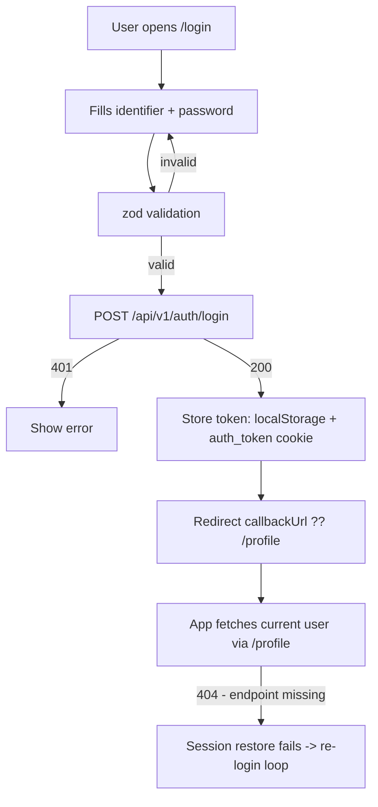
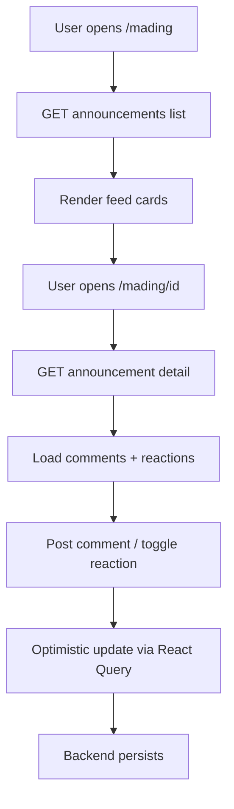
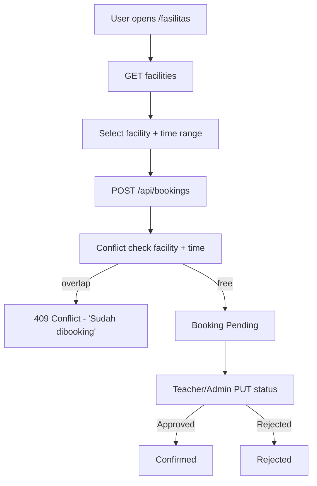
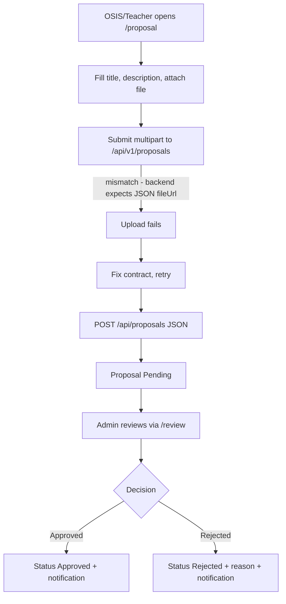

# 12 — Feature Flow

> **MASTER DOCUMENTATION** · StudentCenter · PHASE 022A
> Rule applied: never assume, never hallucinate. Unverifiable statements are marked **"Cannot verify from repository."**

## Table of Contents

1. [Feature Map](#1-feature-map)
2. [Flow 1 — Login](#2-flow-1--login)
3. [Flow 2 — Mading (Announcements)](#3-flow-2--mading-announcements)
4. [Flow 3 — Extracurricular Join](#4-flow-3--extracurricular-join)
5. [Flow 4 — Facility Booking](#5-flow-4--facility-booking)
6. [Flow 5 — Proposal Workflow](#6-flow-5--proposal-workflow)
7. [Flow 6 — Attendance Recording](#7-flow-6--attendance-recording)
8. [Flow 7 — Search](#8-flow-7--search)
9. [Feature vs Implementation Status](#9-feature-vs-implementation-status)

---

## 1. Feature Map

| # | Feature | Frontend page | Backend | Status |
|---|---|---|---|---|
| 1 | Login | `/login` | `/api/auth/login` | ⚠️ broken (field/base mismatch) |
| 2 | Mading | `/mading`, `/mading/[id]` | `/api/announcements*` | ⚠️ path mismatch |
| 3 | Ekskul | `/ekstrakurikuler` | `/api/extracurriculars*` | ⚠️ `/clubs` mismatch |
| 4 | Facility booking | `/fasilitas` | `/api/facilities`, `/api/bookings` | ⚠️ `/slots`, PATCH mismatch |
| 5 | Proposal | `/proposal` | `/api/proposals` | ⚠️ upload mismatch |
| 6 | Attendance | – | `/api/attendances` | ❌ not wired |
| 7 | Search | – | `/api/search` | ❌ not wired |
| 8 | Dashboard | `/admin` `/guru` `/osis` | `/api/dashboard` | ⚠️ base path |

---

## 2. Flow 1 — Login



⚠️ Step D base path + field, and step H endpoint, are the current blockers. See [06_Authentication](06_Authentication.md).

---

## 3. Flow 2 — Mading (Announcements)



Role gates: create/update/delete → Admin/OSIS. Comments → any auth. Edit own comment only.

---

## 4. Flow 3 — Extracurricular Join

```mermaid
flowchart TD
    A[User opens /ekstrakurikuler] --> B[GET club list]
    B --> C[Select club]
    C --> D[GET club detail]
    D --> E{Already a member?}
    E -->|no| F[POST /{id}/join]
    E -->|yes| G[POST /{id}/leave]
    F --> H[Unique index (club,student)]
    H -->|duplicate| I[409]
    H -->|ok| J[Membership created]
```

---

## 5. Flow 4 — Facility Booking



---

## 6. Flow 5 — Proposal Workflow



---

## 7. Flow 6 — Attendance Recording

```mermaid
flowchart TD
    A[Teacher opens attendance view] --> B[Pick date + class]
    B --> C[POST /api/attendances per student]
    C --> D[Unique (student, date) check]
    D -->|duplicate| E[409 - already recorded]
    D -->|ok| F[Record status Present/Late/Absent/Permission/Sick]
```

---

## 8. Flow 7 — Search

```mermaid
flowchart TD
    A[User types keyword] --> B[GET /api/search?keyword=...]
    B --> C[SearchService.ToLower().Contains]
    C --> D[Task.WhenAll over 7 entity types]
    D --> E[Aggregate + group results]
    E --> F[Return unified result]
```

---

## 9. Feature vs Implementation Status

| Feature | Backend | Frontend | Integrable now? |
|---|---|---|---|
| Login | ✅ | ⚠️ | ❌ |
| Mading | ✅ | ⚠️ | ❌ (path) |
| Ekskul | ✅ | ⚠️ | ❌ (path) |
| Facility | ✅ | ⚠️ | ❌ (slots/PATCH) |
| Proposal | ✅ | ⚠️ | ❌ (upload) |
| Dashboard | ✅ | ⚠️ | ❌ (path) |
| Attendance | ✅ | ❌ | – |
| Search | ✅ | ❌ | – |
| Notifications | ✅ | ❌ | – |

> **Bottom line:** every backend feature exists, but **zero end-to-end feature is currently integrable** without contract fixes (base URL `/api` vs `/api/v1` + missing endpoints/methods). See [26_Technical_Debt](26_Technical_Debt.md).

---

*Cross-references: [11_Business_Rules](11_Business_Rules.md) · [14_Sequence_Diagrams](14_Sequence_Diagrams.md) · [docs/Features/*](../Features/)*
