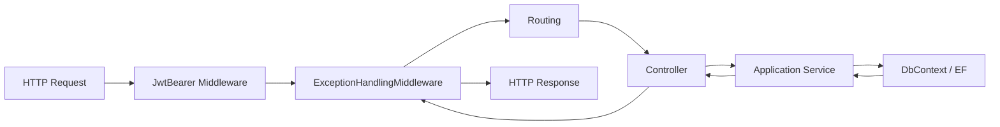
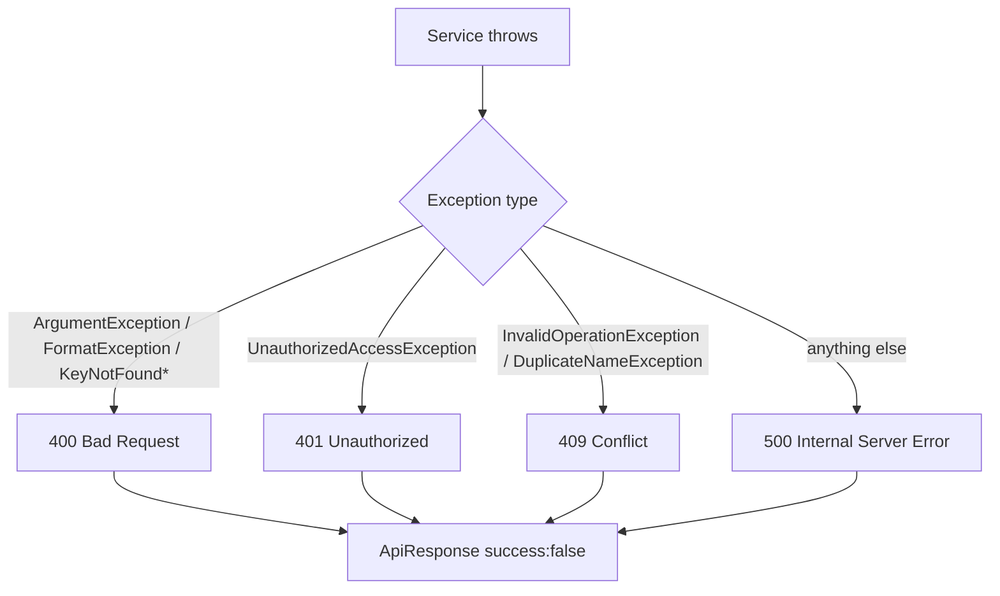

# 13 — Request / Response Flow

> **MASTER DOCUMENTATION** · StudentCenter · PHASE 022A
> Rule applied: never assume, never hallucinate. Unverifiable statements are marked **"Cannot verify from repository."**

## Table of Contents

1. [Lifecycle Overview](#1-lifecycle-overview)
2. [Success Path](#2-success-path)
3. [Error Path](#3-error-path)
4. [Pagination Flow](#4-pagination-flow)
5. [Validation Flow](#5-validation-flow)
6. [Response Envelope Reference](#6-response-envelope-reference)

---

## 1. Lifecycle Overview



---

## 2. Success Path

Example: `GET /api/announcements`

1. Request arrives with `Authorization: Bearer <token>`.
2. JwtBearer authenticates principal (401 if invalid/expired).
3. ExceptionHandlingMiddleware passes through (no exception).
4. Controller action runs; reads `CurrentUserService`.
5. Service queries DbContext (`AsNoTracking()`, paged).
6. Controller returns `Ok(ApiResponse.Success(data))`.

**Response:**

```json
{
  "success": true,
  "message": "Announcements retrieved successfully",
  "data": {
    "items": [],
    "page": 1,
    "pageSize": 10,
    "totalCount": 0,
    "totalPages": 0
  }
}
```

---

## 3. Error Path



| Trigger | Status | Message pattern (Indonesian) |
|---|---|---|
| Validation failure | 400 | e.g., "Judul wajib diisi" (verify per service) |
| Resource not found | 400 ⚠️ | "..." (should be 404 per contract) |
| Wrong credentials | 401 | "Email atau password salah" |
| Conflict (booking overlap / duplicate) | 409 | "Sudah dibooking pada waktu tersebut" (verify) |
| Unexpected | 500 | generic safe message |

> ⚠️ `KeyNotFoundException` currently maps to **400**, but the API contract specifies **404**. See [25_Known_Issues](25_Known_Issues.md).

---

## 4. Pagination Flow

`PagedRequest` (verified):

| Field | Default | Constraint |
|---|---|---|
| `page` | 1 | `>= 1` |
| `pageSize` | 10 | clamped to 1..100 by `Normalize()` |

`PagedResult<T>`:

| Field | Meaning |
|---|---|
| `items` | current page records |
| `page` | current page number |
| `pageSize` | page size |
| `totalCount` | total records across all pages |
| `totalPages` | `ceil(totalCount / pageSize)` |

---

## 5. Validation Flow

Two layers:

1. **DTO/DataAnnotations** — validated by controller `ModelState`; invalid → 400 automatically.
2. **Service rules** — throw `ArgumentException`/`InvalidOperationException` with Indonesian messages; mapped by middleware.

Known DTO constraints (verified):

| DTO | Constraint |
|---|---|
| `LoginRequest` | email required/valid/≤256; password 6–100 |
| `CreateProposalRequest` | title 5–300; description 10–2000; fileUrl ≤500 (all required) |
| `ReviewProposalRequest` | status required; rejectionReason ≤1000 optional |
| `PagedRequest` | page/pageSize with clamp |

---

## 6. Response Envelope Reference

| Shape | Example |
|---|---|
| Single object | `{ success, message, data: { ... } }` |
| Paged list | `{ success, message, data: { items, page, pageSize, totalCount, totalPages } }` |
| No content | `204 No Content` (verify usage) |
| Error | `{ success: false, message: "..." }` |

---

*Cross-references: [02_System_Architecture](02_System_Architecture.md) · [08_API_Catalog](08_API_Catalog.md) · [14_Sequence_Diagrams](14_Sequence_Diagrams.md)*
