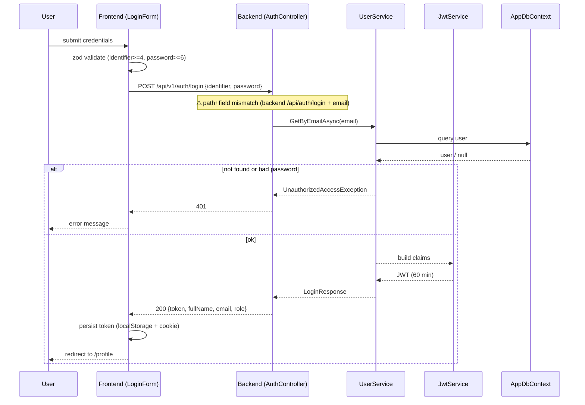
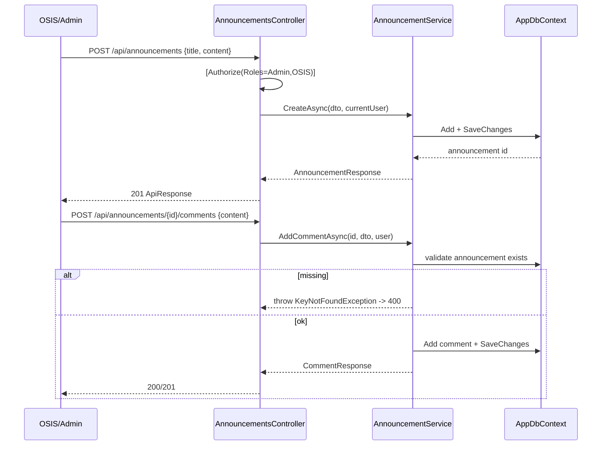
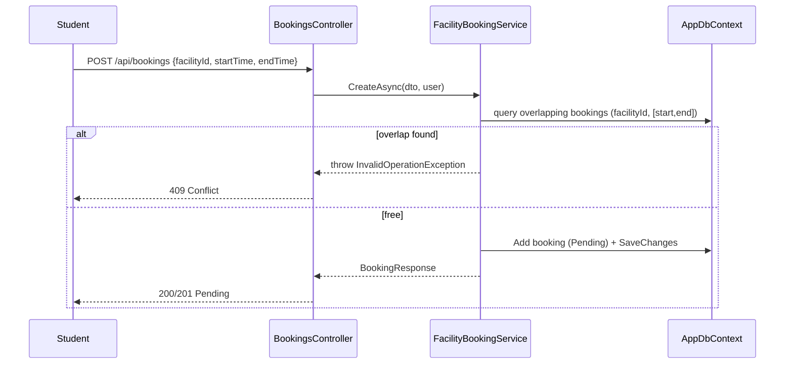
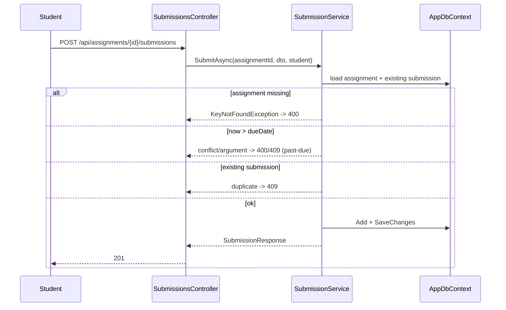
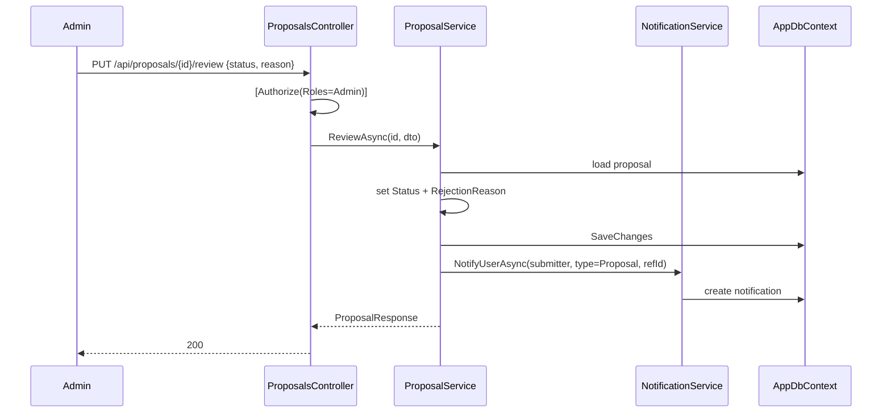
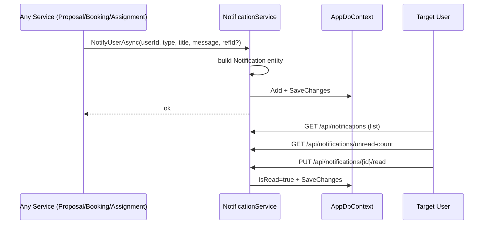
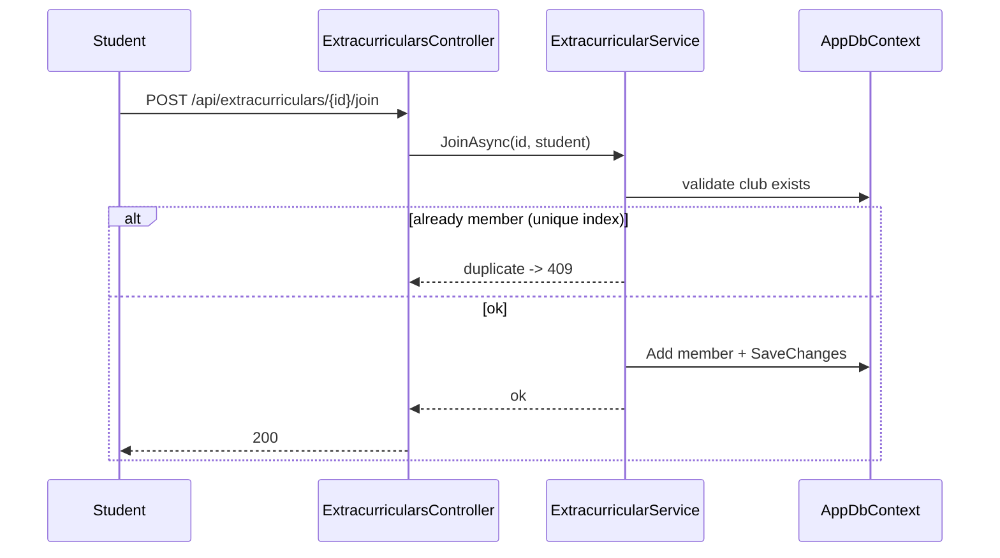

# 14 — Sequence Diagrams

> **MASTER DOCUMENTATION** · StudentCenter · PHASE 022A
> Rule applied: never assume, never hallucinate. Unverifiable statements are marked **"Cannot verify from repository."**

## Table of Contents

1. [1. Login](#1-login)
2. [2. Create Announcement + Comment](#2-create-announcement--comment)
3. [3. Facility Booking with Conflict Check](#3-facility-booking-with-conflict-check)
4. [4. Assignment Submission (Past-Due & Duplicate Rules)](#4-assignment-submission-past-due--duplicate-rules)
5. [5. Proposal Review Flow](#5-proposal-review-flow)
6. [6. Notification Trigger](#6-notification-trigger)
7. [7. Extracurricular Join](#7-extracurricular-join)

---

## 1. Login

---

## 2. Create Announcement + Comment

---

## 3. Facility Booking with Conflict Check

---

## 4. Assignment Submission (Past-Due & Duplicate Rules)

---

## 5. Proposal Review Flow

---

## 6. Notification Trigger

---

## 7. Extracurricular Join

---

*Cross-references: [12_Feature_Flow](12_Feature_Flow.md) · [13_Request_Response_Flow](13_Request_Response_Flow.md) · [02_System_Architecture](02_System_Architecture.md)*
