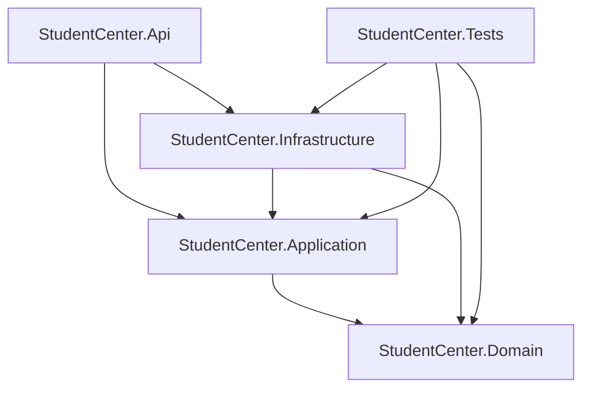
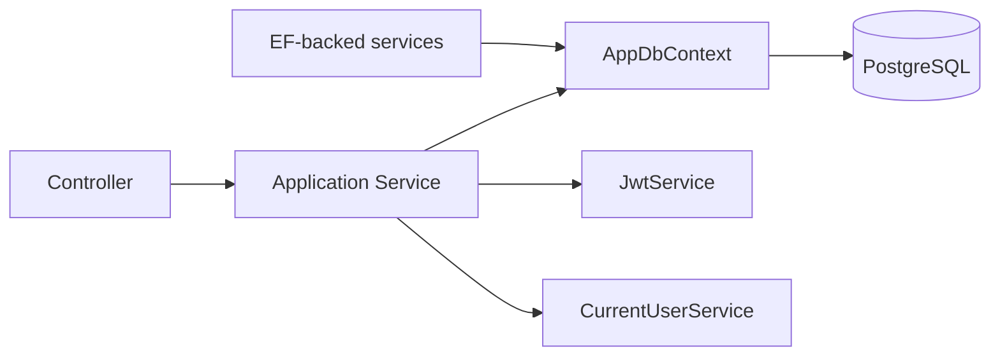

# 20 — Dependency Graph

> **MASTER DOCUMENTATION** · StudentCenter · PHASE 022A
> Rule applied: never assume, never hallucinate. Unverifiable statements are marked **"Cannot verify from repository."**

## Table of Contents

1. [Backend Project Graph](#1-backend-project-graph)
2. [Backend NuGet Packages](#2-backend-nuget-packages)
3. [Frontend npm Packages](#3-frontend-npm-packages)
4. [Test Project Dependencies](#4-test-project-dependencies)
5. [Module Dependency Map (Runtime)](#5-module-dependency-map-runtime)
6. [Dependency Health](#6-dependency-health)

---

## 1. Backend Project Graph

Verified from `.csproj` files:

| Project | References |
|---|---|
| `Domain` | *(none)* — pure entities/enums |
| `Application` | `Domain` |
| `Infrastructure` | `Application`, `Domain` |
| `Api` | `Application`, `Infrastructure` |
| `Tests` | `Application`, `Domain`, `Infrastructure` |

---

## 2. Backend NuGet Packages

**Api (`StudentCenter.Api`):**

| Package | Version | Purpose |
|---|---|---|
| `Microsoft.AspNetCore.OpenApi` | 10.0.10 | OpenAPI (⚠️ NU1903 advisory via transitive `Microsoft.OpenApi 2.0.0`) |
| `Swashbuckle.AspNetCore` | 6.6.2 | Swagger UI |
| `Microsoft.EntityFrameworkCore.Tools` | 10.0.10 | migrations |

**Infrastructure (`StudentCenter.Infrastructure`):**

| Package | Version |
|---|---|
| `Microsoft.EntityFrameworkCore` | 10.0.10 |
| `Microsoft.EntityFrameworkCore.Design` | 10.0.10 |
| `Npgsql.EntityFrameworkCore.PostgreSQL` | 10.0.3 |
| `Microsoft.AspNetCore.Authentication.JwtBearer` | 10.0.10 |
| `Microsoft.Extensions.Configuration.Abstractions` | (transitive) |

**Application / Domain:** no external packages (verify — `Application.csproj` only references Domain).

---

## 3. Frontend npm Packages

From `frontend/package.json`:

| Package | Version | Purpose |
|---|---|---|
| `next` | 16.2.12 | framework |
| `react` / `react-dom` | 19.2.4 | UI |
| `tailwindcss` | ^4.0.0 | styling |
| `@tanstack/react-query` | 5.66.0 | server state |
| `axios` | 1.7.9 | HTTP |
| `react-hook-form` | 7.54.2 | forms |
| `@hookform/resolvers` | 3.10.0 | RHF+zod bridge |
| `zod` | 3.24.2 | validation |
| `lucide-react` | 0.475.0 | icons |
| `motion` | ^11 | animation |

---

## 4. Test Project Dependencies

| Package | Version |
|---|---|
| `xunit` | 2.9.3 |
| `xunit.runner.visualstudio` | 3.1.4 |
| `Microsoft.NET.Test.Sdk` | 17.14.1 |
| `Moq` | 4.20.72 |
| `FluentAssertions` | 8.10.0 |
| `Microsoft.EntityFrameworkCore.InMemory` | 10.0.10 |
| `Microsoft.EntityFrameworkCore.Relational` | 10.0.10 |
| `coverlet.collector` | 6.0.4 |

---

## 5. Module Dependency Map (Runtime)

- Controllers depend on service interfaces (DI).
- Services depend on `AppDbContext` + cross-cutting services (`CurrentUserService`, `NotificationService`).
- `SeedAdminData` runs at startup (Api → Infrastructure seeder).

---

## 6. Dependency Health

| Check | Status |
|---|---|
| Build (restore + compile) | ✅ PASS |
| `dotnet list package --vulnerable` | ⚠️ 2× `NU1903` (Microsoft.OpenApi 2.0.0, GHSA-v5pm-xwqc-g5wc, High) |
| Outdated backend deps | verify with `dotnet list package --outdated` |
| `npm audit` | **Cannot verify from repository** (not run during audit) |
| Circular project references | ✅ none |
| Unused packages | possible (`motion`, `coverlet` usage — verify) |

**Remediation for NU1903:** update `Microsoft.AspNetCore.OpenApi` (or pin `Microsoft.OpenApi` ≥ patched). See [26_Technical_Debt](26_Technical_Debt.md).

---

*Cross-references: [04_Backend_Architecture](04_Backend_Architecture.md) · [03_Frontend_Architecture](03_Frontend_Architecture.md) · [26_Technical_Debt](26_Technical_Debt.md)*
