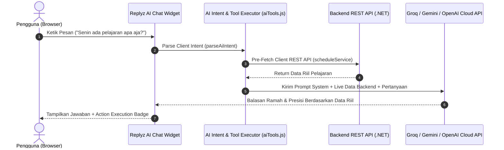

# 🤖 DOKUMENTASI SISTEM REPLYZ AI & CLIENT-SIDE FUNCTION CALLING

**Student Center SMKN 2 Surakarta (PPLG Center)**
*Arsitektur Asisten Virtual AI Terintegrasi REST API & Action Execution Engine*

---

## 📌 OVERVIEW

Replyz adalah Asisten Virtual AI interaktif yang ditempatkan di pojok kanan bawah aplikasi web Student Center SMKN 2 Surakarta.
Sistem ini menggunakan arsitektur **Hybrid Client-Side Pre-Fetching + LLM Function Calling**, sehingga AI dapat mengambil data riil dari backend REST API dan mengeksekusi aksi UI langsung di browser pengguna tanpa memerlukan endpoint server AI khusus.

---

## ⚙️ ARSITEKTUR & ALUR KERJA (CLIENT-SIDE EXECUTION)



### Keunggulan Eksekusi Client-Side:
1. **Kecepatan Tinggi (Low Latency):** Data backend langsung diambil dari React Client Services (`announcementService`, `scheduleService`, `notificationService`) yang memanfaatkan token sesi pengguna yang aktif.
2. **Presisi 100% (Zero Hallucination):** AI diberikan data riil sebelum menyusun kalimat jawaban, sehingga AI tidak akan pernah berkata *"saya tidak memiliki akses ke backend"*.
3. **Privasi & Keamanan:** Token autentikasi pengguna tetap aman di memori client dan tidak pernah dikirimkan ke pihak ketiga.

---

## 🛠️ PETA AKSI & TOOLS (FUNCTION CALLING MATRIX)

| Nama Tool / Aksi | Deskripsi | Parameter | Contoh Trigger Pengguna |
| :--- | :--- | :--- | :--- |
| `navigate_to_page` | Pindah rute halaman secara otomatis | `route` (string) | *"Bawa aku ke jadwal"*, *"Ke profil page"* |
| `highlight_ui_element` | Memberikan efek spotlight bercahaya pada elemen UI | `target` (`login_button`, `notif_button`, `theme_toggle`) | *"Di mana tombol login?"*, *"Sorot notifikasi"* |
| `open_modal` | Membuka popup modal secara otomatis | `modalName` (`login`, `notification_center`) | *"Buka modal login"*, *"Aku mau login"* |
| `get_latest_announcements` | Mengambil pengumuman sekolah terbaru dari REST API | `limit` (number) | *"Ada pengumuman apa hari ini?"* |
| `get_class_schedule` | Mengambil jadwal pelajaran harian dari REST API | `day` / `className` | *"Jadwal pelajaran hari ini"*, *"Senin ada kelas apa"* |
| `get_user_notifications` | Mengambil jumlah notifikasi belum dibaca | `-` | *"Cek notifikasi saya"* |

---

## 🗺️ PETA ROUTE & LOKASI APP (ROUTING MATRIX)

| Rute | Nama Halaman | Fungsi |
| :--- | :--- | :--- |
| `/` | Beranda Utama | Landing Page PPLG Center, stats, highlight mading & fasilitas |
| `/kelas` | Kelas & Jadwal | Timetable pelajaran harian & pengampu matpel |
| `/pengumuman` | Mading Digital | Pengumuman resmi sekolah & artikel siswa |
| `/fasilitas` | Katalog Fasilitas | Peminjaman Lab Komputer, Studio Game & Perpus Digital |
| `/komunitas` | Circle PPLG | Forum komunitas siswa PPLG, share proyek & diskusi |
| `/perpustakaan` | Perpustakaan | Katalog buku digital & peminjaman |
| `/kalender` | Kalender Sekolah | Agenda kegiatan & libur akademik |
| `/profile` | Profil Siswa | Data profil siswa & pengaturan akun |

---

## 🌐 KONFIGURASI ENVIRONMENT VARIABLE (`.env.local`)

File konfigurasi berada di `frontend/.env.local`:

```env

```

---

## 📄 STRUKTUR FILE KODE REPLYZ AI

- **`src/components/AiChatModal.jsx`**: UI Modal Popover & Floating Mascot Trigger `<BloubMascot />`.
- **`src/services/aiService.js`**: Client-Side Pre-Fetching, Multi-Provider LLM Router (Groq / Gemini / OpenAI), dan Prompt Injection Engine.
- **`src/services/aiTools.js`**: Intent Parser & Direct REST API Action Executors.
- **`src/app/providers.jsx`**: Global layout mounting untuk aksesibilitas di semua halaman.
