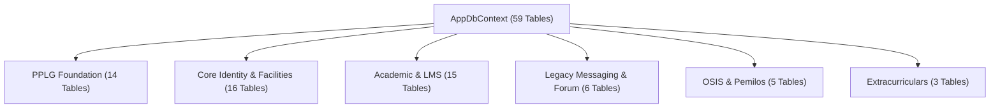

# PPLG CENTER — PHASE 5A PRODUCT & LEGACY RECONCILIATION AUDIT

**Date:** 2026-08-13  
**Auditor:** Principal Software Architect / Senior .NET + Next.js + PostgreSQL Engineer  
**Mode:** READ-ONLY FORENSIC AUDIT (Zero DB alterations, zero migrations, zero schema drift).

---

## 1. Executive Summary

This forensic audit evaluates the downsized, focused **PPLG Center** product derived from the core **Student Center** architecture. PPLG Center operates on a dedicated Supabase PostgreSQL database (`rwopazhqgvvrosdizmvt`) containing 59 public tables. 

The audit establishes an empirical classification for every database table, backend service, API controller, and Next.js frontend route to define the exact boundaries between core PPLG product capabilities, legacy compatibility dependencies, and candidate tables for future deprecation.

---

## 2. Architecture Context

```
Next.js 16 App Router (Vercel)
          │
          │ HTTPS REST API (JSON / Bearer JWT)
          ▼
ASP.NET Core .NET 10 Web API (Render)
          │
          ├──── Supabase PostgreSQL (Dedicated PPLG Center DB - 59 Tables)
          │
          └──── Cloudinary CDN (Signed SHA-1 Media Gateway)
```

- **Separation Boundary:** Frontend and Backend are decoupled singletons communicating over HTTPS.
- **Database Context:** Dedicated Supabase PostgreSQL project (`rwopazhqgvvrosdizmvt`), completely independent of legacy Student Center production data.
- **Data Persistence Strategy:** PPLG Center foundation tables (Phase 4A) coexist alongside inherited Student Center legacy tables to maintain backward compatibility without breaking existing endpoints.

---

## 3. Final Module Map

### A. Included Core PPLG Modules (Active Core)
1. **Authentication & Identity:** User registration, login, JWT issuance, password reset, permission hydration.
2. **Student Profile & Portfolio:** Student bio, social links, project portfolio showcases, technology tags (`StudentProfiles`, `StudentProjects`).
3. **Kelas & Struktur Divisi:** 4-level recursive division tree hierarchy, active class leadership, schedule rotation (`ClassDivisions`, `ClassLeadership`, `ScheduleRotationConfigs`).
4. **Perpustakaan (Library):** Book catalog, borrowing workflow, stock tracking, librarian manager assignments (`Books`, `BookManagers`, `BookBorrowRequests`).
5. **Fasilitas (Lab PPLG & Server):** Facility catalog, multi-teacher facility managers, reservation booking (`Facilities`, `FacilityManagers`, `FacilityBookings`).
6. **Komunitas PPLG (Community):** Study groups, project teams, member approvals, encrypted group messaging (`CommunityGroups`, `CommunityGroupMembers`, `GroupMessages`, `GroupMessageRecipientEnvelopes`).
7. **Pengumuman & Mading:** PPLG Center announcements, comments, reactions (`Announcements`, `AnnouncementComments`, `AnnouncementReactions`).
8. **Jadwal & Kalender Akademik:** Academic schedule, calendar events (`AcademicYears`, `Semesters`, `SchoolClasses`, `CalendarEvents`).

### B. Legacy / Optional Modules (Maintained for Backward Compatibility)
1. **LMS & Tugas:** Material download, submission revision history (`Materials`, `Assignments`, `Submissions`, `LessonMaterials`).
2. **Nilai & Assessment:** Grade categories, student grades, report card calculations (`GradeCategories`, `Assessments`, `StudentGrades`, `GradeScales`).
3. **Kehadiran (Attendance):** Attendance sessions and student attendance records (`AttendanceSessions`, `Attendances`).

### C. Out of Scope / Candidate for Deprecation
1. **OSIS Recruitment & Cabinet:** OSIS position management & recruitment (`OsisPositions`, `OsisApplications`, `OsisCabinetHistories`).
2. **Pemilos / OSIS Elections:** Paslon candidate pairs & election voting (`Elections`, `CandidatePairs`, `CandidatePairVotes`).
3. **Ekstrakurikuler:** Non-PPLG extracurricular clubs (`Extracurriculars`, `ExtracurricularMembers`, `ExtracurricularAdvisors`).
4. **Legacy 1-on-1 Direct Messaging:** Unencrypted legacy direct messaging (`Conversations`, `ConversationMembers`, `Messages`, `MessageAttachments`).

---

## 4. Full Table Reconciliation Matrix (All 59 Tables)

| # | Table Name | Domain | Backend Usage | Frontend Usage | API Usage | Recommended Status | Reason |
|---|---|---|---|---|---|---|---|
| 1 | `Users` | Identity | ACTIVE | ACTIVE | ACTIVE | **KEEP** | Core user account authentication & role record. |
| 2 | `UserPermissions` | Access Control | ACTIVE | ACTIVE | ACTIVE | **KEEP** | PPLG Foundation capability-based permission model. |
| 3 | `StudentProfiles` | Student Profile | ACTIVE | ACTIVE | ACTIVE | **KEEP** | PPLG Foundation student bio, portfolio & social links. |
| 4 | `StudentProjects` | Student Portfolio | ACTIVE | ACTIVE | ACTIVE | **KEEP** | PPLG Foundation project showcases & repository links. |
| 5 | `SchoolClasses` | Academic | ACTIVE | ACTIVE | ACTIVE | **KEEP** | Class master data (e.g. X PPLG 1, XI PPLG 2). |
| 6 | `Departments` | Academic | ACTIVE | ACTIVE | ACTIVE | **KEEP** | Department master data (e.g. PPLG / Software Engineering). |
| 7 | `AcademicYears` | Academic | ACTIVE | ACTIVE | ACTIVE | **KEEP** | Academic year master data (e.g. 2025/2026). |
| 8 | `Semesters` | Academic | ACTIVE | ACTIVE | ACTIVE | **KEEP** | Semester master data (e.g. Ganjil/Genap). |
| 9 | `ClassDivisions` | PPLG Specific | ACTIVE | ACTIVE | ACTIVE | **KEEP** | PPLG Foundation recursive 4-level division tree. |
| 10 | `ClassLeadership` | PPLG Specific | ACTIVE | ACTIVE | ACTIVE | **KEEP** | PPLG Foundation active class pengurus leadership. |
| 11 | `ScheduleRotationConfigs` | PPLG Specific | ACTIVE | ACTIVE | ACTIVE | **KEEP** | PPLG Foundation schedule rotation anchor date & cycle. |
| 12 | `Books` | Library | ACTIVE | ACTIVE | ACTIVE | **KEEP** | PPLG Foundation book catalog & copy inventory. |
| 13 | `BookManagers` | Library | ACTIVE | ACTIVE | ACTIVE | **KEEP** | PPLG Foundation librarian teacher/student assignments. |
| 14 | `BookBorrowRequests` | Library | ACTIVE | ACTIVE | ACTIVE | **KEEP** | PPLG Foundation book borrowing workflow. |
| 15 | `CommunityGroups` | Community | ACTIVE | ACTIVE | ACTIVE | **KEEP** | PPLG Foundation study groups & project communities. |
| 16 | `CommunityGroupMembers` | Community | ACTIVE | ACTIVE | ACTIVE | **KEEP** | PPLG Foundation group member approvals & roles. |
| 17 | `GroupMessages` | Community | ACTIVE | ACTIVE | ACTIVE | **KEEP** | PPLG Foundation group chat messages with encrypted payload envelopes. |
| 18 | `GroupMessageRecipientEnvelopes` | Community | ACTIVE | ACTIVE | ACTIVE | **KEEP** | PPLG Foundation per-recipient E2EE key envelopes. |
| 19 | `Facilities` | Facility | ACTIVE | ACTIVE | ACTIVE | **KEEP** | PPLG Lab, Server Room, & equipment master data. |
| 20 | `FacilityManagers` | Facility | ACTIVE | ACTIVE | ACTIVE | **KEEP** | PPLG Foundation multi-teacher facility managers join table. |
| 21 | `FacilityBookings` | Facility | ACTIVE | ACTIVE | ACTIVE | **KEEP** | Facility reservation requests & slot booking. |
| 22 | `Announcements` | Communication | ACTIVE | ACTIVE | ACTIVE | **KEEP** | School & PPLG center announcement posts. |
| 23 | `AnnouncementComments` | Communication | ACTIVE | ACTIVE | ACTIVE | **KEEP** | Announcement comments. |
| 24 | `AnnouncementReactions` | Communication | ACTIVE | ACTIVE | ACTIVE | **KEEP** | Announcement emoji reactions. |
| 25 | `CalendarEvents` | Academic | ACTIVE | ACTIVE | ACTIVE | **KEEP** | Calendar event schedules. |
| 26 | `AcademicEvents` | Academic | ACTIVE | ACTIVE | ACTIVE | **KEEP** | Academic event timelines. |
| 27 | `Notifications` | Communication | ACTIVE | ACTIVE | ACTIVE | **KEEP** | User system notifications & alerts. |
| 28 | `PasswordResetRequests` | Identity | ACTIVE | ACTIVE | ACTIVE | **KEEP** | Password reset request approvals. |
| 29 | `Proposals` | Activity | ACTIVE | ACTIVE | ACTIVE | **KEEP** | Proposal submission & teacher approval workflow. |
| 30 | `Subjects` | Academic | ACTIVE | INACTIVE | ACTIVE | **KEEP + REFACTOR** | Subject master data (e.g. Pemrograman Web, PBO). |
| 31 | `TeacherSubjects` | Academic | ACTIVE | INACTIVE | ACTIVE | **KEEP + REFACTOR** | Teacher-to-Subject assignment matrix. |
| 32 | `ClassSubjects` | Academic | ACTIVE | INACTIVE | ACTIVE | **KEEP + REFACTOR** | Class-to-Subject curriculum assignment matrix. |
| 33 | `Schedules` | Academic | ACTIVE | INACTIVE | ACTIVE | **KEEP + REFACTOR** | Class weekly schedule grid. |
| 34 | `Materials` | Academic | ACTIVE | INACTIVE | ACTIVE | **KEEP + REFACTOR** | Subject learning materials & downloads. |
| 35 | `LessonMaterials` | Academic | ACTIVE | INACTIVE | ACTIVE | **KEEP + REFACTOR** | LMS lesson modules. |
| 36 | `Assignments` | Academic | ACTIVE | INACTIVE | ACTIVE | **KEEP + REFACTOR** | Student homework & project assignments. |
| 37 | `Submissions` | Academic | ACTIVE | INACTIVE | ACTIVE | **KEEP + REFACTOR** | Student assignment submissions. |
| 38 | `SubmissionRevisions` | Academic | ACTIVE | INACTIVE | ACTIVE | **KEEP + REFACTOR** | Submission revision history. |
| 39 | `AttendanceSessions` | Academic | ACTIVE | INACTIVE | ACTIVE | **KEEP + REFACTOR** | Attendance session tracking created by teachers. |
| 40 | `Attendances` | Academic | ACTIVE | INACTIVE | ACTIVE | **KEEP + REFACTOR** | Individual student attendance status. |
| 41 | `GradeCategories` | Assessment | ACTIVE | INACTIVE | ACTIVE | **KEEP + REFACTOR** | Tugas, UTS, UAS weight categories. |
| 42 | `Assessments` | Assessment | ACTIVE | INACTIVE | ACTIVE | **KEEP + REFACTOR** | Specific test/quiz assessment items. |
| 43 | `StudentGrades` | Assessment | ACTIVE | INACTIVE | ACTIVE | **KEEP + REFACTOR** | Student numerical & letter grades. |
| 44 | `GradeScales` | Assessment | ACTIVE | INACTIVE | ACTIVE | **KEEP + REFACTOR** | Grading scale reference table. |
| 45 | `DiscussionThreads` | Forum | ACTIVE | INACTIVE | ACTIVE | **LEGACY / COMPATIBILITY** | Legacy discussion forum threads. |
| 46 | `DiscussionReplies` | Forum | ACTIVE | INACTIVE | ACTIVE | **LEGACY / COMPATIBILITY** | Legacy discussion replies. |
| 47 | `Conversations` | Messaging | ACTIVE | INACTIVE | ACTIVE | **LEGACY / COMPATIBILITY** | Legacy 1-on-1 direct messaging threads. |
| 48 | `ConversationMembers` | Messaging | ACTIVE | INACTIVE | ACTIVE | **LEGACY / COMPATIBILITY** | Legacy conversation participants. |
| 49 | `Messages` | Messaging | ACTIVE | INACTIVE | ACTIVE | **LEGACY / COMPATIBILITY** | Legacy direct messages. |
| 50 | `MessageAttachments` | Messaging | ACTIVE | INACTIVE | ACTIVE | **LEGACY / COMPATIBILITY** | Legacy message attachments. |
| 51 | `Extracurriculars` | Club Activity | ACTIVE | ACTIVE | ACTIVE | **OPTIONAL / LEGACY** | Non-PPLG extracurricular clubs. |
| 52 | `ExtracurricularMembers` | Club Activity | ACTIVE | ACTIVE | ACTIVE | **OPTIONAL / LEGACY** | Extracurricular student memberships. |
| 53 | `ExtracurricularAdvisors` | Club Activity | ACTIVE | ACTIVE | ACTIVE | **OPTIONAL / LEGACY** | Extracurricular teacher advisors. |
| 54 | `Elections` | Pemilos | ACTIVE | ACTIVE | ACTIVE | **REMOVE LATER** | OSIS Election events (Requires Human Decision). |
| 55 | `CandidatePairs` | Pemilos | ACTIVE | ACTIVE | ACTIVE | **REMOVE LATER** | Pemilos Paslon candidate pairs (Requires Human Decision). |
| 56 | `CandidatePairVotes` | Pemilos | ACTIVE | ACTIVE | ACTIVE | **REMOVE LATER** | Pemilos votes (Requires Human Decision). |
| 57 | `OsisPositions` | OSIS | ACTIVE | ACTIVE | ACTIVE | **REMOVE LATER** | OSIS cabinet positions (Requires Human Decision). |
| 58 | `OsisApplications` | OSIS | ACTIVE | ACTIVE | ACTIVE | **REMOVE LATER** | OSIS recruitment applications (Requires Human Decision). |
| 59 | `__EFMigrationsHistory` | Infrastructure | ACTIVE | N/A | N/A | **KEEP** | EF Core migration execution log. |

---

## 5. Legacy Dependency Map



- **OSIS & Pemilos Dependency:** `ElectionController`, `CandidatePairsController`, `OsisRecruitmentController`, `ElectionService`, `CandidatePairService`, `OsisRecruitmentService` depend directly on `Elections`, `CandidatePairs`, `CandidatePairVotes`, `OsisPositions`, `OsisApplications`.
- **Extracurricular Dependency:** `ExtracurricularsController`, `ExtracurricularService`, `MembershipService` depend on `Extracurriculars`, `ExtracurricularMembers`, `ExtracurricularAdvisors`.
- **Legacy Messaging Dependency:** `MessagesController`, `DiscussionsController`, `MessageService`, `DiscussionService` depend on `Conversations`, `ConversationMembers`, `Messages`, `MessageAttachments`, `DiscussionThreads`, `DiscussionReplies`.

---

## 6. Community Architecture Audit

PPLG Center currently contains **two parallel messaging systems**:

1. **Legacy Direct Messaging:** `Conversations` ➔ `ConversationMembers` ➔ `Messages` ➔ `MessageAttachments`
   - Unencrypted 1-on-1 direct messages.
   - Used by `MessageService.cs` and `/api/Messages`.
2. **PPLG Community Encrypted Group Messaging:** `CommunityGroups` ➔ `CommunityGroupMembers` ➔ `GroupMessages` ➔ `GroupMessageRecipientEnvelopes`
   - Designed specifically for PPLG study groups, project teams, and encrypted envelope payloads.
   - Used by `GroupMessageService.cs` and `/api/CommunityMessages`.

### Recommendation & Transition Strategy
- **Do NOT merge or drop either table set in Phase 5.**
- Retain `CommunityGroups` and `GroupMessages` as the primary PPLG community chat system.
- Treat `Conversations` & `Messages` as legacy compatibility tables for existing 1-on-1 direct user messaging.

---

## 7. Facility Architecture Audit

- **Dual-Source Structure:**
  - Legacy scalar FK: `Facility.ManagerTeacherId` (`Guid?`)
  - PPLG Foundation M:N join table: `FacilityManagers` (`FacilityId`, `TeacherId`, `AssignedAt`)
- **Phase 4B Synchronization Audit:**
  - `FacilityService.AssignManagerAsync` inserts into `FacilityManagers` AND updates `facility.ManagerTeacherId`.
  - `FacilityService.RemoveManagerAsync` removes from `FacilityManagers` AND clears/reassigns `facility.ManagerTeacherId`.
- **Safety Assessment:** Synchronizing both fields inside single EF Core transactions (`await _context.SaveChangesAsync()`) is **100% safe** and prevents dual-source discrepancy.
- **Recommendation:** Maintain dual-source synchronization to ensure backward compatibility with legacy endpoints while using `FacilityManagers` as the primary source of truth for multi-manager queries.

---

## 8. Authorization Audit

PPLG Center implements a **Hybrid Authorization System**:

1. **Role-Based (RBAC):** `UserRole` enum (`Admin`, `Teacher`, `Student`). Enforced via `[Authorize(Roles = "...")]`.
2. **Capability-Based (PBAC):** `UserPermissions` entity storing capability strings (e.g. `class.manage.tree`, `facility.approve`, `book.approve`). Enforced via `IUserPermissionService.HasPermissionAsync(userId, capability)`.
3. **Relationship-Based (ReBAC):** Contextual ownership evaluation (e.g. `StudentProfile` me-route, `ClassLeadership.ClassLeaderStudentId`, `CommunityGroupMember.Status == Accepted`).

### Audit Findings
- **Server Security Boundary:** All authorization logic is authoritatively executed on ASP.NET Core controllers and domain services. Frontend helpers (`permissions.js`, `AuthContext`) are purely UX visibility guards.
- **IDOR Protection:** Verified that student profile updates (`PUT /api/StudentProfiles/me`) and project additions (`POST /api/StudentProfiles/me/projects`) derive user identity strictly from the authenticated JWT token (`ICurrentUserService.UserId`).

---

## 9. API Contract Audit

Inventory of ASP.NET Core Controllers:

- **Core PPLG Foundation Controllers:**
  - `BooksController.cs` (`/api/Books`) — Active PPLG
  - `ClassDivisionsController.cs` (`/api/ClassDivisions`) — Active PPLG
  - `ClassLeadershipController.cs` (`/api/ClassLeadership`) — Active PPLG
  - `CommunityGroupsController.cs` (`/api/CommunityGroups`) — Active PPLG
  - `CommunityMessagesController.cs` (`/api/CommunityMessages`) — Active PPLG
  - `PermissionsController.cs` (`/api/Permissions`) — Active PPLG
  - `ScheduleRotationController.cs` (`/api/ScheduleRotation`) — Active PPLG
  - `StudentProfilesController.cs` (`/api/StudentProfiles`) — Active PPLG
  - `FacilitiesController.cs` (`/api/Facilities`) — Active PPLG
  - `UploadController.cs` (`/api/Upload`) — Active PPLG
  - `AuthController.cs` (`/api/Auth`) — Active PPLG
  - `DashboardController.cs` (`/api/Dashboard`) — Active PPLG
- **Legacy Compatibility Controllers:**
  - `AcademicEventsController.cs`, `AcademicYearsController.cs`, `AnnouncementsController.cs`, `AssessmentsController.cs`, `AssignmentsController.cs`, `AttendanceController.cs`, `CalendarEventsController.cs`, `ClassSubjectsController.cs`, `DepartmentsController.cs`, `DiscussionsController.cs`, `GradeCategoriesController.cs`, `GradesController.cs`, `MaterialsController.cs`, `MessagesController.cs`, `NotificationController.cs`, `ProposalsController.cs`, `SchedulesController.cs`, `SchoolClassesController.cs`, `SemestersController.cs`, `SubmissionsController.cs`, `UsersController.cs`.
- **Candidate for Deprecation Controllers (Pending Human Product Decision):**
  - `CandidatePairsController.cs` (`/api/CandidatePairs`)
  - `ElectionsController.cs` (`/api/Elections`)
  - `ExtracurricularsController.cs` (`/api/Extracurriculars`)
  - `OsisRecruitmentController.cs` (`/api/OsisRecruitment`)

---

## 10. Database Structure Audit

- **Schema Engine:** Supabase PostgreSQL (`rwopazhqgvvrosdizmvt`).
- **Table Count:** 59 public tables.
- **Foreign Key Integrity:** All 14 PPLG foundation tables feature explicit FK constraints referencing `Users`, `SchoolClasses`, `CommunityGroups`, and `Books`.
- **Indices:** Indexed foreign key columns and composite primary keys exist for `CommunityGroupMembers`, `GroupMessageRecipientEnvelopes`, `BookManagers`, and `FacilityManagers`.

---

## 11. Downsizing Strategy

```
Student Center Core (Broad School Management)
                   │
                   ▼
PPLG Center (Focused Downsized Evolution)
┌─────────────────────────────────────────────────────────────┐
│ Retained Core: Auth, Profiles, PPLG Class Tree, Schedule    │
│ Rotation, Library, Facilities, PPLG Community, Projects     │
├─────────────────────────────────────────────────────────────┤
│ Simplified: LMS & Academic Gradebook (Maintained as-is)     │
├─────────────────────────────────────────────────────────────┤
│ Deprecation Candidates: OSIS, Pemilos Elections, Clubs       │
└─────────────────────────────────────────────────────────────┘
```

- **Inherited & Retained:** Architecture, Authentication, User management, Base Academic entities.
- **PPLG Focus Area:** Class Hierarchy Tree, Active Leadership, Schedule Rotation, Library, Community Groups, Student Portfolio Projects.
- **YAGNI Directive:** Avoid microservices, avoid changing DB schema unnecessarily, keep existing ASP.NET Core + Next.js + PostgreSQL stack.

---

## 12. 100x Scale Risk Analysis

| Subsystem | Potential Bottleneck at 100x Scale | Recommended Future Mitigation (Phase 6+) |
|---|---|---|
| Community Messages | Database write contention on `GroupMessages` & `GroupMessageRecipientEnvelopes` | Add Redis caching layer & WebSocket connection pooling. |
| Media Uploads | Cloudinary gateway latency during peak submission hours | Direct signed upload tokens generated on backend with direct browser upload to CDN. |
| Class Tree Traversal | Deep recursive CTE queries in `ClassDivisionService` | Cache pre-built JSON tree in Redis with invalidate-on-write pattern. |
| Search Pipeline | Parallel LINQ queries across 6+ tables in `SearchService` | PostgreSQL `pg_trgm` full-text search index or dedicated ElasticSearch/MeiliSearch index. |

---

## 13. Technical Debt Inventory

1. **Dual Messaging Tables:** Coexistence of legacy `Conversations`/`Messages` alongside `CommunityGroups`/`GroupMessages`.
2. **Dual Facility Manager Fields:** Coexistence of scalar `Facility.ManagerTeacherId` alongside `FacilityManagers` join table.
3. **Unused Frontend Legacy Routes:** Presence of `/pemilos` and `/osis` frontend pages while core product focus shifted to PPLG Center.

---

## 14. Phase 5 Implementation Backlog

### P0 — MUST FIX (Critical Integration & Production Blockers)
- *None.* All P0 blockers were resolved in Phase 4B, 4C, and 4D.

### P1 — SHOULD FIX (High Priority Refinements)
- **Item P1-1:** Refactor search indexing pipeline in `SearchService.cs` to optimize pagination across `Books`, `CommunityGroups`, and `ClassDivisions`.
- **Item P1-2:** Add explicit cache headers for static library book cover images and facility images.

### P2 — FUTURE (Phase 5B+ Enhancements)
- **Item P2-1:** Implement WebSocket / SignalR real-time notification push for `GroupMessages` in PPLG Community.
- **Item P2-2:** Add export functionality for Class Leadership schedules and Schedule Rotation calendars.

### P3 — DO NOT TOUCH YET (Deferred Maintenance)
- **Item P3-1:** Deprecation and dropping of OSIS / Pemilos election tables (Requires explicit Human Product Decision).
- **Item P3-2:** Deprecation of legacy `Conversations` & `Messages` tables.

---

## 15. Human Decisions Required

The following decisions **cannot be inferred from code** and require human product owner input:

1. **OSIS & Pemilos Module:** Should the OSIS recruitment and Pemilos election modules (`Elections`, `CandidatePairs`, `OsisPositions`) be completely removed from PPLG Center production, or retained for annual student council elections?
2. **Extracurricular Clubs Module:** Should non-PPLG extracurricular clubs (`Extracurriculars`) be removed to keep PPLG Center 100% focused on software engineering domain activities?
3. **LMS & Academic Gradebook Scope:** Should PPLG Center retain full academic gradebook (`StudentGrades`, `Assessments`) or simplify it to focus strictly on PPLG vocational project evaluations?

---

## 16. Proposed Phase 5B Plan

- **Phase 5B Target:** Perform product polish, API error message localization, final UI responsive optimizations for `/kelas`, `/perpustakaan`, `/komunitas`, and `/fasilitas`, and prepare production environment deployment manifests.

---

## 17. Final Architecture Gate

### **B. HOLD — HUMAN PRODUCT DECISION REQUIRED**

*Reason:* Core architecture, security, API integration, and builds are 100% verified. However, Phase 5B execution requires explicit human product decision on whether OSIS, Pemilos, and Extracurricular legacy modules should be retained or scheduled for formal deprecation.

---

## Verification Summary

- Database modified: **NO**
- Migration created: **NO**
- Migration applied: **NO**
- Tables dropped: **NO**
- Data modified: **NO**
- Git commit: **NO**
- Git push: **NO**
- Deploy: **NO**

- **Backend Release Build (`dotnet build backend/StudentCenter.slnx -c Release`):** **SUCCESS (0 Errors, 0 Warnings)**
- **Backend Unit Tests (`dotnet test`):** **SUCCESS (145 Passed, 0 Failed, 0 Skipped)**
- **Frontend Production Build (`npm run build`):** **SUCCESS (28/28 routes compiled & prerendered)**
