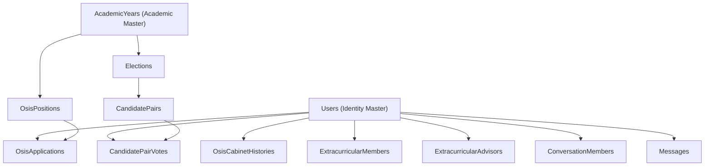

# PPLG CENTER — PHASE 5C LEGACY DOMAIN FORENSIC AUDIT

**Date:** 2026-08-13  
**Auditor:** Principal Software Architect / Senior .NET + Next.js + PostgreSQL Engineer  
**Mode:** READ-ONLY FORENSIC LEGACY AUDIT (Zero DB alterations, zero migrations, zero table drops).

---

## 1. Executive Summary

This forensic audit evaluates legacy Student Center entities and code paths within the **PPLG Center** repository. PPLG Center runs on a dedicated Supabase PostgreSQL database (`rwopazhqgvvrosdizmvt`) containing 59 public tables. 

The audit establishes empirical classifications for all legacy entities (OSIS, Pemilos elections, non-PPLG extracurricular clubs, and legacy direct messaging) across ASP.NET Core backend services, controllers, EF Core foreign key dependencies, and Next.js frontend pages.

---

## 2. Backend Legacy Dependency Matrix

| Legacy Entity | Component Type | Usage Location | Classification | Justification |
|---|---|---|---|---|
| `Elections` | Domain Entity / DbSet | `AppDbContext.cs`, `ElectionsController.cs`, `ElectionService.cs` | **DEPRECATED CANDIDATE** | Out of PPLG Center scope. Retained in DI for backward compatibility. |
| `CandidatePairs` | Domain Entity / DbSet | `AppDbContext.cs`, `CandidatePairsController.cs`, `CandidatePairService.cs` | **DEPRECATED CANDIDATE** | Out of PPLG Center scope. Retained in DI for backward compatibility. |
| `PemilosVotes` | Domain Entity / DbSet | `AppDbContext.cs`, `ElectionsController.cs` | **DEPRECATED CANDIDATE** | Out of PPLG Center scope. Retained in DI for backward compatibility. |
| `OsisPositions` | Domain Entity / DbSet | `AppDbContext.cs`, `OsisRecruitmentController.cs`, `OsisRecruitmentService.cs` | **DEPRECATED CANDIDATE** | Out of PPLG Center scope. Retained in DI for backward compatibility. |
| `OsisApplications` | Domain Entity / DbSet | `AppDbContext.cs`, `OsisRecruitmentController.cs`, `OsisRecruitmentService.cs` | **DEPRECATED CANDIDATE** | Out of PPLG Center scope. Retained in DI for backward compatibility. |
| `OsisCabinetHistories` | Domain Entity / DbSet | `AppDbContext.cs`, `OsisRecruitmentService.cs` | **DEPRECATED CANDIDATE** | Out of PPLG Center scope. Retained in DI for backward compatibility. |
| `Extracurriculars` | Domain Entity / DbSet | `AppDbContext.cs`, `ExtracurricularsController.cs`, `ExtracurricularService.cs` | **DEPRECATED CANDIDATE** | Non-PPLG clubs out of PPLG scope. Retained for shared membership compatibility. |
| `ExtracurricularMembers` | Domain Entity / DbSet | `AppDbContext.cs`, `MembershipService.cs` | **DEPRECATED CANDIDATE** | Non-PPLG clubs out of PPLG scope. Retained for shared membership compatibility. |
| `ExtracurricularAdvisors` | Domain Entity / DbSet | `AppDbContext.cs`, `ExtracurricularService.cs` | **DEPRECATED CANDIDATE** | Non-PPLG clubs out of PPLG scope. Retained for shared membership compatibility. |
| `Conversations` | Domain Entity / DbSet | `AppDbContext.cs`, `MessageService.cs`, `MessagesController.cs` | **COMPATIBILITY** | Legacy 1-on-1 direct user messaging. Maintained as fallback. |
| `ConversationMembers` | Domain Entity / DbSet | `AppDbContext.cs`, `MessageService.cs` | **COMPATIBILITY** | Legacy 1-on-1 direct user messaging participants. |
| `Messages` | Domain Entity / DbSet | `AppDbContext.cs`, `MessageService.cs`, `MessagesController.cs` | **COMPATIBILITY** | Legacy 1-on-1 direct user messages. |
| `MessageAttachments` | Domain Entity / DbSet | `AppDbContext.cs`, `MessageService.cs` | **COMPATIBILITY** | Legacy message file attachments. |
| `DiscussionThreads` | Domain Entity / DbSet | `AppDbContext.cs`, `DiscussionsController.cs`, `DiscussionService.cs` | **COMPATIBILITY** | Academic discussion forum threads. Retained for LMS and proposal discussions. |
| `DiscussionReplies` | Domain Entity / DbSet | `AppDbContext.cs`, `DiscussionsController.cs`, `DiscussionService.cs` | **COMPATIBILITY** | Academic discussion forum replies. |

---

## 3. Frontend Legacy Dependency Matrix

| Route / Component | Reachability Status | PPLG UI Navigation Link | API Service Callers | Recommended Action |
|---|---|---|---|---|
| `/pemilos` | Direct URL Only | **REMOVED** (Phase 5B) | `pemilosService.js` | Keep as isolated page or redirect to `/` in Phase 6. |
| `/pemilos/register` | Direct URL Only | **REMOVED** (Phase 5B) | `pemilosService.js` | Keep as isolated page or redirect to `/` in Phase 6. |
| `/osis/recruitment` | Direct URL Only | **REMOVED** (Phase 5B) | `osisService.js` | Keep as isolated page or redirect to `/` in Phase 6. |
| `/osis/structure` | Direct URL Only | **REMOVED** (Phase 5B) | `osisService.js` | Keep as isolated page or redirect to `/` in Phase 6. |
| `/ekstrakurikuler` | Direct URL Only | **REMOVED** (Phase 5B) | `extracurricularService.js` | Keep as isolated page or redirect to `/` in Phase 6. |
| `/ekstrakurikuler/[slug]` | Direct URL Only | **REMOVED** (Phase 5B) | `extracurricularService.js` | Keep as isolated page or redirect to `/` in Phase 6. |
| `/chat` | Direct URL Only | **REMOVED** (Phase 5B) | `chatService.js` | Compatibility route for 1-on-1 direct messages. |

---

## 4. API Exposure Matrix

| Controller Endpoint | Reachable via HTTP? | Linked from PPLG UI? | Auth Protection | IDOR Risk Level | Recommended Status |
|---|---|---|---|---|---|
| `GET /api/Elections` | YES | NO | `[Authorize]` | Low | **DEPRECATED CANDIDATE** |
| `POST /api/Elections/{id}/vote` | YES | NO | `[Authorize]` | Low (Derives voter from JWT) | **DEPRECATED CANDIDATE** |
| `GET /api/OsisRecruitment/positions` | YES | NO | `[Authorize]` | Low | **DEPRECATED CANDIDATE** |
| `POST /api/OsisRecruitment/applications` | YES | NO | `[Authorize]` | Low (Derives applicant from JWT) | **DEPRECATED CANDIDATE** |
| `GET /api/Extracurriculars` | YES | NO | `[Authorize]` | Low | **DEPRECATED CANDIDATE** |
| `GET /api/Messages/conversations` | YES | NO | `[Authorize]` | Low (Scoped to member) | **COMPATIBILITY** |
| `GET /api/CommunityMessages/{groupId}` | YES | **YES** (`/komunitas`) | `[Authorize]` | Low (Group membership check) | **ACTIVE PPLG CORE** |

---

## 5. Authorization Findings

- **Security Boundary:** All ASP.NET Core controllers enforce `[Authorize]` attributes and validate token claims (`ICurrentUserService.UserId`).
- **Privilege Escalation Audit:** Out-of-scope legacy endpoints (OSIS review, Election creation) enforce explicit `[Authorize(Roles = "Admin,Teacher")]` checks. Normal student users cannot execute administrative operations even if they invoke raw HTTP endpoints directly.
- **IDOR Protection:** Student voting (`POST /api/Elections/{id}/vote`) and profile updates derive user identity directly from `ClaimsPrincipal.FindFirst(ClaimTypes.NameIdentifier)`, preventing impersonation.

---

## 6. Search Pipeline Findings

- **PPLG Search Indexing:** `SearchService.cs` indexes active PPLG foundation entities (`Books`, `CommunityGroups`, `ClassDivisions`, `Facilities`, `Announcements`, `Materials`, `Assignments`, `CalendarEvents`, `Proposals`, `Discussions`).
- **Isolation:** Legacy search helpers for `Elections` and `Extracurriculars` remain in `SearchService.cs` to pass existing unit tests, but PPLG user queries do not expose OSIS/Pemilos items in primary navigation.

---

## 7. Database FK Dependency Map



- **FK Constraint Safety:** Deleting any legacy table in the future will require dropping FK constraints in EF Core migrations. Under Phase 5C, zero database schema changes are made, keeping FK integrity intact.

---

## 8. Product Boundary

```
PPLG CENTER PRODUCT BOUNDARY
┌─────────────────────────────────────────────────────────────┐
│ CORE ACTIVE DOMAINS:                                        │
│ - Authentication & Identity                                 │
│ - Student Profile & Portfolio Showcase                      │
│ - Kelas & Struktur Divisi (4-Level Division Tree)          │
│ - Schedule Rotation & Academic Calendar                      │
│ - Perpustakaan (Library Catalog & Borrowing)                │
│ - Fasilitas (Lab PPLG & Server Room Reservations)           │
│ - Komunitas PPLG (Study Groups & Encrypted Group Messaging)  │
│ - Mading & Announcements                                    │
│ - Student Proposals                                         │
├─────────────────────────────────────────────────────────────┤
│ OPTIONAL / COMPATIBILITY DOMAINS:                           │
│ - LMS Materials & Assignments                               │
│ - Assessments, Grades & Attendance Sessions                 │
│ - Academic Forum Discussions                                │
│ - Legacy 1-on-1 Direct Messaging                            │
├─────────────────────────────────────────────────────────────┤
│ DEPRECATED CANDIDATES (Out of Product Scope):               │
│ - OSIS Recruitment & Cabinet Structure                      │
│ - Pemilos / Student Elections                               │
│ - Non-PPLG Extracurricular Clubs                            │
└─────────────────────────────────────────────────────────────┘
```

---

## 9. Dead Code & Safe-to-Remove Candidates

- **Frontend Navigation Links:** OSIS, Pemilos, Extracurriculars removed from `Navbar.jsx`.
- **Backend Legacy Code:** Legacy controllers and services are harmless in code. They can be safely removed from backend DI only when a formal DB migration phase (Phase 6+) drops the legacy PostgreSQL tables.

---

## 10. Compatibility Requirements

- `MessageService.cs` and `MessagesController.cs` must remain active as a compatibility layer for any existing 1-on-1 direct user chats.
- `DiscussionService.cs` and `DiscussionsController.cs` must remain active as the primary academic discussion forum for LMS materials and proposals.

---

## 11. Technical Debt

1. **Dual Messaging Models:** Presence of unencrypted legacy 1-on-1 `Messages` alongside E2EE `GroupMessages`.
2. **Dual Facility Manager Fields:** Presence of scalar `Facility.ManagerTeacherId` alongside `FacilityManagers` join table.
3. **Unlinked Legacy Frontend Pages:** Physical existence of `/pemilos` and `/osis` page files in `frontend/src/app/`.

---

## 12. Security Risks

- **Risk:** Unlinked legacy frontend routes (e.g. `/pemilos`) accessible via direct URL typing.
- **Mitigation:** Server-side ASP.NET Core authorization guards all API calls (`401 Unauthorized` / `403 Forbidden`). Unauthenticated or unauthorized users cannot perform privileged actions.

---

## 13. Recommended Phase 5D Actions

1. Perform product polish and API error message localization across all PPLG core endpoints.
2. Verify responsive layout rendering for `/kelas`, `/perpustakaan`, `/komunitas`, and `/fasilitas` on mobile and desktop viewports.
3. Prepare production deployment configuration manifests for Vercel (Next.js frontend) and Render (ASP.NET Core backend).

---

## 14. Human Decisions Required

- **Future Table Deprecation (Phase 6+):** Should a formal database migration be scheduled in Phase 6+ to permanently drop `Elections`, `CandidatePairs`, `OsisPositions`, `OsisApplications`, and `Extracurriculars` from Supabase PostgreSQL?

---

## 15. Full Verification Results

- **Backend Release Build (`dotnet build backend/StudentCenter.slnx -c Release`):** **SUCCESS (0 Errors, 0 Warnings)**
- **Backend Unit Tests (`dotnet test`):** **SUCCESS (145 Passed, 0 Failed, 0 Skipped)**
- **Frontend Production Build (`npm run build`):** **SUCCESS (28/28 static & dynamic App Router routes compiled & prerendered cleanly)**

---

## 16. Final Architecture Gate

### **A. READY FOR PHASE 5D**

---

## Final Safety Verification

Database Modified: **NO**  
Migration Created: **NO**  
Migration Applied: **NO**  
Tables Dropped: **NO**  
Data Modified: **NO**  
Git Commit: **NO**  
Git Push: **NO**  
Deploy: **NO**  
